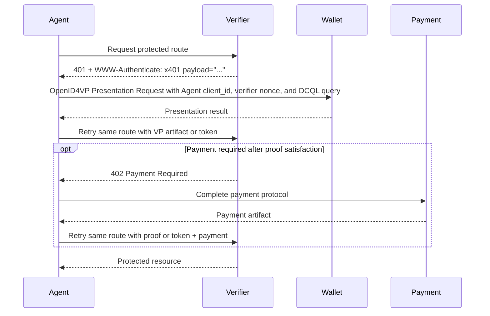
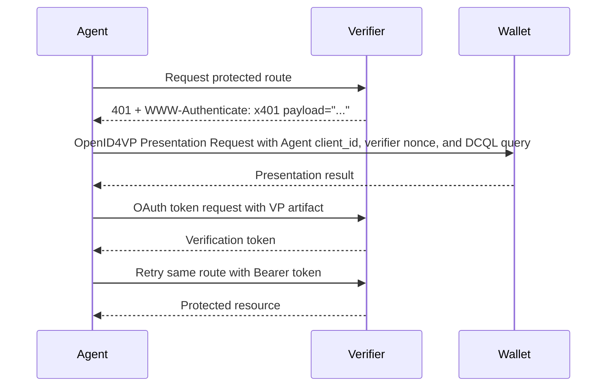

x401: HTTP Proof Requirement Protocol
==================

Status: [[badge: Draft]]

Version: 0.1.0

Editors:
~ [Daniel Buchner](https://www.linkedin.com/in/dbuchner) - [Proof](https://proof.com)
~ [Darren Louie](https://www.linkedin.com/in/darrenlouie) - [Proof](https://proof.com)

Participate:
~ [GitHub repo](https://github.com/proof/x401)
~ [File an issue](https://github.com/proof/x401/issues)
~ [Commit history](https://github.com/proof/x401/commits/main)

------------------------------------

## Abstract

x401 defines an HTTP-based, route-scoped proof requirement protocol for requiring credential-based proof before access to a protected resource is granted.

x401 uses:

- **HTTP 401 Unauthorized** to signal that proof is required
- **Digital Credentials Query Language (DCQL)** to describe the credential requirements for a protected route
- **OpenID for Verifiable Presentations (OpenID4VP)** for the Agent-created presentation request
- **OAuth 2.0** for optional exchange of a verified presentation for an access token
- **DIF Credential Trust Establishment** for verifier-approved issuer policy and non-authoritative acquisition guidance
- **OpenID for Verifiable Credential Issuance (OpenID4VCI)** for resolving credential issuer metadata when the referenced trust document identifies OpenID4VCI issuers

The x401 payload is not a fully composed OpenID4VP Authorization Request. The Verifier returns the presentation protocol, DCQL requirements, Verifier Challenge value, issuer trust reference, and OAuth token exchange metadata the Agent needs in order to create its own OpenID4VP Authorization Request for a Wallet.

x401 is intentionally separate from payment protocols. When payment is required, it MUST be handled with **HTTP 402 Payment Required** and an appropriate payment protocol. x401 MUST NOT redefine payment semantics.

This document defines the x401 payload, processing rules, interoperability requirements, and examples for proof requirements with optional payment handling.

::: note Protocol Boundary
x401 defines proof requirement semantics only. When payment is required, implementations still use `402 Payment Required` and a separate payment protocol.
:::

## Status of This Document

This is a draft specification. It is provided in a style intended to be similar to DIF single-file specifications.

## Introduction

HTTP provides a standard challenge mechanism for authentication via `401 Unauthorized` and `WWW-Authenticate`, but it does not define a general-purpose, machine-readable protocol for route-scoped proof requirements such as:

- proving personhood
- proving country of residency
- proving membership or accreditation
- proving entitlement issued by a specific issuer class
- proving organizational standing
- proving workload identity attributes

At the same time, OpenID4VP, DCQL, OAuth, and OpenID4VCI define interoperable mechanisms for requesting presentations, evaluating credential requirements, issuing access tokens, and issuing credentials, but they are not themselves an HTTP route proof requirement protocol.

x401 fills that gap by defining an HTTP-native wrapper that:

- signals proof requirements at the protected route
- carries the x401 payload as a base64url value in the `WWW-Authenticate` response header
- carries DCQL requirements for the route
- carries a Verifier Challenge value composed from the Verifier's identifier and a cryptographic nonce
- gives the Agent the information required to create a valid OpenID4VP Authorization Request for its Wallet
- includes OAuth token exchange metadata for Agents that want a reusable access token after proving
- optionally includes a DIF Credential Trust Establishment URL that can help Agents discover acceptable credential issuers
- composes with, but does not subsume, payment protocols

In the typical flow, an [[ref: Agent]] receives an x401 proof requirement from a [[ref: Verifier]], creates a wallet-facing [[ref: Presentation Request]] that includes the Verifier's [[ref: DCQL Requirement]] and [[ref: Verifier Challenge]], receives a verifiable presentation from a [[ref: Wallet]], and retries the original protected route. An [[ref: Issuer Trust List]] can help the Agent discover credentials or issuers, but the Verifier remains authoritative for issuer trust enforcement.

## Design Goals

The goals of x401 are:

1. Define a route-scoped proof requirement for HTTP resources.
2. Allow Verifiers to send proof requirements without composing the Agent's OpenID4VP Authorization Request.
3. Require the Agent to bind the wallet presentation to its own identifier while preserving a verifier-originated Verifier Challenge.
4. Reuse DCQL, OpenID4VP, OAuth, and OpenID4VCI.
5. Remain separate from payment semantics.
6. Allow issuer discovery by reference to verifier trust policy without listing issuers inline in the x401 payload.
7. Support stateless verifier deployments by allowing Verifier Challenge correlation context to be encoded in verifier-protected nonce values.
8. Allow additional caller authentication, request signing, and delegation artifacts to compose with x401 without making any one agent identity system mandatory.

## Non-Goals

x401 does not:

- define a new credential format
- replace OpenID4VP
- replace OpenID4VCI
- define the transport used to deliver an OpenID4VP request to a Wallet
- define a payment protocol
- require all Verifiers to maintain server-side session state
- define a universal agent authentication protocol

## Terminology

The key words **MUST**, **MUST NOT**, **REQUIRED**, **SHALL**, **SHALL NOT**, **SHOULD**, **SHOULD NOT**, **RECOMMENDED**, **NOT RECOMMENDED**, **MAY**, and **OPTIONAL** in this document are to be interpreted as described in RFC 2119 and RFC 8174.

[[def: Verifier]]:
~ The party protecting a resource or operation and requiring proof.

[[def: Agent]]:
~ The HTTP caller that requests a protected route, receives an x401 proof requirement, creates a wallet-facing OpenID4VP presentation request, receives proof material from a Wallet, and retries the protected route. The Agent uses an [[ref: Agent Identifier]] for client binding.

[[def: Agent Identifier]]:
~ An identifier for the Agent that the Verifier can bind to the HTTP caller. This specification does not register a single Agent Identifier scheme; a Verifier policy MUST define which schemes it accepts, including any accepted DID, HTTPS origin, domain-bound client identifier, or certificate-bound identifier schemes.

[[def: Holder]]:
~ The subject or entity that possesses credentials and can authorize a Wallet to present proof.

[[def: Wallet]]:
~ Software capable of receiving an OpenID4VP presentation request from an Agent and returning a verifiable presentation result authorized by a [[ref: Holder]].

[[def: Presentation Request]]:
~ An OpenID4VP Authorization Request created by the Agent. It includes the [[ref: DCQL Requirement]] from the x401 payload as `dcql_query`, uses the [[ref: Verifier Challenge]] value as `nonce`, and identifies the Agent as the OpenID4VP client.

[[def: DCQL Requirement]]:
~ The DCQL query supplied by the Verifier in the x401 payload that describes the credentials, claims, predicates, or constraints that must be satisfied for the protected route.

[[def: Verifier Challenge]]:
~ A nonce-bearing object generated by the Verifier. It contains a challenge value and expiry. The challenge value is composed from, or bound to, the Verifier's identifier and a fresh cryptographic nonce. The Agent uses this exact value as the OpenID4VP `nonce` in its wallet-facing Presentation Request.

[[def: Issuer Trust List]]:
~ A verifier-controlled DIF Credential Trust Establishment document that identifies the issuers, authorities, roles, activities, credential schemas, or credential types the Verifier accepts for a proof requirement. The same document can also help Agents discover where qualifying credentials may be obtained.

[[def: VP Artifact]]:
~ A retry artifact containing the Wallet's presentation result and the x401 metadata needed by the Verifier to validate proof fulfillment for an [[ref: Agent Identifier]], encoded for use in the HTTP `Authorization` request header or OAuth token exchange.

[[def: Verification Token]]:
~ A verifier-issued, short-lived access token returned after successful proof verification and used by the [[ref: Agent]] on later protected-route requests so that the VP Artifact does not need to be repeated.

[[def: x401 Payload]]:
~ The JSON object defined by this specification, UTF-8 encoded, and carried as a base64url value in the `payload` parameter of the `WWW-Authenticate: x401` response header.

## Protocol Overview

The x401 protocol is made up of four legs: a Verifier exposes identity proof requirements that gate access to a resource, the Agent turns the requirements into a wallet-facing OpenID4VP request, the Agent submits the Wallet's presentation result back to the Verifier, and the Agent may exchange that proof for a reusable Verification Token. The tabs below summarize each leg and link to the detailed section that defines the processing rules that pertain to them.

::: tabs

:: 1. Gated Resource

The Verifier protects a route by returning `401 Unauthorized` with a `WWW-Authenticate: x401` header. The header carries the base64url-encoded x401 payload that defines the route's proof requirement; see [x401 Gated Resource Configuration](#x401-gated-resource-configuration) for details.

```http
HTTP/1.1 401 Unauthorized
WWW-Authenticate: x401 payload="<base64url-x401-payload>"
Cache-Control: no-store
```

:: 2. Agent Presentation

The Agent decodes the x401 payload and creates its own OpenID4VP Authorization Request for the Wallet. It preserves the Verifier's DCQL requirement and uses the exact Verifier Challenge value as the OpenID4VP `nonce`; see [Agent-Generated Verifiable Presentation](#agent-generated-verifiable-presentation) for details.

```json
{
  "response_type": "vp_token",
  "client_id": "decentralized_identifier:did:web:agent.example",
  "nonce": "x401:aHR0cHM6Ly9yZXNlYXJjaC5leGFtcGxlLmNvbQ:uX7Vq3mZJH6MeN0qz2L7SQ",
  "dcql_query": {
    "credentials": [
      {
        "id": "board_certification",
        "format": "jwt_vc_json"
      }
    ]
  },
  "response_uri": "https://agent.example/wallet/callback/7c9e"
}
```

:: 3. VP Submission

After the Wallet returns a presentation result, the Agent packages it as a VP Artifact for protected-route retry. The VP Artifact carries the Agent Identifier, Verifier Challenge, and Wallet-returned proof material; see [Verifiable Presentation Submission](#verifiable-presentation-submission) for details.

```json
{
  "agent_id": "did:web:agent.example",
  "challenge": "x401:aHR0cHM6Ly9yZXNlYXJjaC5leGFtcGxlLmNvbQ:uX7Vq3mZJH6MeN0qz2L7SQ",
  "vp_token": "<wallet-returned-vp-token>"
}
```

:: 4. Token Acquisition

The Agent can submit the same VP Artifact to the Verifier's OAuth token endpoint to obtain a reusable Verification Token. The token exchange uses fixed x401 token-exchange parameters and then the Agent retries protected routes with the returned Bearer token; see [Access Token Acquisition](#access-token-acquisition) for details.

```http
POST /oauth/token HTTP/1.1
Host: research.example.com
Content-Type: application/x-www-form-urlencoded

grant_type=urn:ietf:params:oauth:grant-type:token-exchange&
subject_token_type=urn:x401:params:oauth:token-type:vp_artifact&
subject_token=<base64url-vp-artifact-json>
```

:::

### Primary Flow

In the primary x401 flow, the [[ref: Agent]] is the HTTP caller and is assumed to have access to a [[ref: Wallet]], keys, credentials, or local capabilities needed to fulfill the proof requirement.

1. The [[ref: Agent]] requests a protected route.
2. The [[ref: Verifier]] determines that proof is required.
3. The [[ref: Verifier]] returns `401 Unauthorized` with:
   - `WWW-Authenticate: x401 payload="<base64url-x401-payload>"`
4. The [[ref: Agent]] decodes the x401 payload and extracts the OpenID4VP presentation protocol, DCQL Requirement, Verifier Challenge, and OAuth token endpoint.
5. The [[ref: Agent]] creates a wallet-facing OpenID4VP Presentation Request. The request MUST use the x401 Verifier Challenge as its `nonce` value, MUST include the x401 DCQL Requirement as its `dcql_query`, and MUST identify the Agent as the OpenID4VP client.
6. The [[ref: Wallet]] returns a presentation result to the [[ref: Agent]].
7. The [[ref: Agent]] retries the same protected route that produced the x401 proof requirement with either:
   - a [[ref: VP Artifact]] in the HTTP `Authorization` request header, or
   - a [[ref: Verification Token]] obtained by exchanging the VP Artifact at the OAuth token endpoint from the x401 payload.
8. The [[ref: Verifier]] validates the VP Artifact or Verification Token.
9. If proof is satisfied and payment is not required or is already satisfied, the [[ref: Verifier]] returns the protected resource.
10. If proof is satisfied but payment remains unsatisfied, the [[ref: Verifier]] returns `402 Payment Required` with payment protocol details. After satisfying payment, the [[ref: Agent]] retries the same route with proof or token material and the payment artifact required by the selected payment protocol.



### Optional OAuth Token Exchange

An Agent MAY exchange a VP Artifact for a Verification Token before retrying the protected route. The token endpoint is supplied by the Verifier in the x401 payload.



The technical sections that follow are organized by the four main legs of the protocol: x401 gated resource configuration, Agent-generated verifiable presentation, verifiable presentation submission, and access token acquisition.

## x401 Gated Resource Configuration

The initial leg of the protocol defines how a protected HTTP resource declares what proof is required. The Verifier responds to the original protected-route request with `401 Unauthorized` and a `WWW-Authenticate: x401` header whose `payload` parameter contains the base64url-encoded x401 payload.

```http
GET /papers/medical-study-123 HTTP/1.1
Host: research.example.com
Accept: application/json

HTTP/1.1 401 Unauthorized
WWW-Authenticate: x401 payload="<base64url-x401-payload>"
Cache-Control: no-store
```

### HTTP Semantics

Status Code | Meaning in a x401-capable deployment | Agent expectation
----------- | ------------------------------------ | ----------------
`401 Unauthorized` | Proof is required or not yet satisfied | Inspect `WWW-Authenticate: x401` and decode the x401 payload
`402 Payment Required` | Payment remains unsatisfied | Switch to the payment protocol
`403 Forbidden` | Proof was presented but policy satisfaction failed | Do not treat this as another proof requirement

#### 401 for Proof

A server that requires proof for access to a protected resource MUST return `401 Unauthorized`.

The response MUST include a `WWW-Authenticate` header using the `x401` scheme.

Example:

```http
HTTP/1.1 401 Unauthorized
WWW-Authenticate: x401 payload="<base64url-x401-payload>"
Cache-Control: no-store
```

The `payload` parameter MUST contain the base64url-encoded [[ref: x401 Payload]]. An x401 proof requirement response SHOULD NOT require the Agent to parse a response body in order to understand the proof requirement.

The proof requirement response uses `WWW-Authenticate` because `Authorization` is an HTTP request header. The Agent uses `Authorization` only when retrying the protected route with a [[ref: VP Artifact]] or [[ref: Verification Token]].

#### 402 for Payment

A server that requires payment MUST use `402 Payment Required` and MUST NOT overload x401 to represent payment as proof.

Payment metadata MAY be declared in a x401 payload for informational purposes when payment may also be required, but payment satisfaction itself remains governed by the payment protocol used with `402`.

#### 403 for Failed Policy Satisfaction

If an Agent submits a proof artifact that is structurally valid but does not satisfy the Verifier's policy, the Verifier SHOULD return `403 Forbidden`.

Examples include:

- credential from an untrusted issuer
- credential does not satisfy predicates
- expired or revoked credential
- presentation audience does not match the Agent Identifier
- challenge value does not match the expected verifier identifier and nonce
- insufficient assurance level

### x401 Proof Requirement Scheme

The `WWW-Authenticate` header identifies the presence of an x401 proof requirement. In HTTP terminology the header carries an authentication challenge; this specification uses "x401 proof requirement" for the overall route-gating declaration and reserves [[ref: Verifier Challenge]] for the nonce-bearing `proof.challenge` object.

#### Header Syntax

An x401 proof requirement uses the following general form:

```http
WWW-Authenticate: x401 payload="<base64url-x401-payload>"
```

#### Header Parameters

Name | Definition
---- | ----------
`payload` | REQUIRED. The base64url-encoded UTF-8 JSON [[ref: x401 Payload]]. The encoded value MUST omit padding. The decoded value MUST be a single JSON object.

Other x401 proof requirement parameters MAY be defined by future versions of this specification. A Verifier MUST NOT place authoritative x401 proof requirement data only in non-`payload` parameters in this version.

### x401 Payload

A x401 payload is a single JSON object encoded into the `payload` parameter of the `WWW-Authenticate: x401` response header. The payload is base64url-encoded, using the URL and filename safe alphabet defined by RFC 4648 Section 5 without padding, so it can be carried safely as an HTTP authentication parameter.

The payload SHOULD remain compact. Sensitive route state SHOULD be omitted, stored server-side, or carried only inside verifier-protected nonce state.

#### Top-Level Members

```json
{
  "scheme": "x401",
  "version": "0.1.0",
  "proof": {},
  "payment": {}
}
```

#### Member Definitions

Name | Definition
---- | ----------
`scheme` | REQUIRED. Value MUST be the string `"x401"`.
`version` | REQUIRED. The x401 payload version.
`proof` | REQUIRED. Contains the presentation protocol, DCQL Requirement, Verifier Challenge, issuer trust reference, OAuth token exchange metadata, and reusable requirement identifiers.
`payment` | OPTIONAL. Describes that payment is additionally required, without replacing `402` semantics.

### Proof Object

The proof object gives the Agent the verifier-supplied values it needs to create its own Presentation Request and later retry the protected route.

#### General Structure

```json
{
  "presentation_protocol": "openid4vp",
  "dcql_query": {
    "credentials": [
      {
        "id": "board_certification",
        "format": "jwt_vc_json",
        "meta": {
          "type_values": ["BoardCertificationCredential"]
        },
        "claims": [
          {
            "path": ["credentialSubject", "boardCertification", "status"],
            "values": ["active"]
          }
        ]
      }
    ]
  },
  "challenge": {
    "value": "x401:aHR0cHM6Ly9yZXNlYXJjaC5leGFtcGxlLmNvbQ:uX7Vq3mZJH6MeN0qz2L7SQ",
    "expires_at": "2026-05-06T18:45:00Z"
  },
  "oauth": {
    "token_endpoint": "https://research.example.com/oauth/token"
  },
  "issuers": {
    "trust_establishment_url": "https://research.example.com/.well-known/x401/trust/board-certified-doctor-v1"
  },
  "request_id": "proof-template-board-certified-doctor-v1",
  "satisfied_requirements": [
    "urn:example:x401:satisfaction:board-certified-doctor:v1"
  ]
}
```

#### Members

Name | Definition
---- | ----------
`presentation_protocol` | REQUIRED. Identifies the wallet-facing presentation protocol the Agent MUST use. For this version of x401, the value MUST be `"openid4vp"`.
`dcql_query` | REQUIRED. The DCQL Requirement for the protected route. The Agent MUST include this value as the `dcql_query` in its Presentation Request.
`challenge` | REQUIRED. The Verifier Challenge object. The Agent MUST include `challenge.value` as the OpenID4VP `nonce` in its Presentation Request.
`oauth` | REQUIRED. OAuth token exchange metadata. It gives the Agent the endpoint, and any optional resource or audience values, needed to exchange a VP Artifact for a Verification Token.
`issuers` | OPTIONAL. References verifier-approved issuer trust policy for the proof requirement. When present, this object MUST identify an [[ref: Issuer Trust List]] and MUST NOT list approved issuers inline.
`request_id` | OPTIONAL. A stable verifier-defined identifier for the proof template. This value can be reused across Verifier Challenge instances and routes when they ask for the same proof requirement.
`satisfied_requirements` | OPTIONAL. An array of stable verifier-defined identifiers for the reusable proof requirements that will be marked satisfied if this proof is fulfilled.

#### Verifier Challenge Members

Name | Definition
---- | ----------
`value` | REQUIRED. The exact value the Agent MUST use as the OpenID4VP `nonce` in its Presentation Request.
`expires_at` | REQUIRED. The time after which the Verifier will reject the Verifier Challenge. The value MUST be an RFC 3339 timestamp.

#### OAuth Members

Name | Definition
---- | ----------
`token_endpoint` | REQUIRED. OAuth 2.0 token endpoint where the Agent can exchange a VP Artifact for a Verification Token.
`audience` | OPTIONAL. OAuth token exchange `audience` value the Agent should request.
`resource` | OPTIONAL. OAuth token exchange `resource` value the Agent should request.

The x401 OAuth profile fixes `grant_type`, `subject_token_type`, and Bearer token usage. These values MUST NOT be repeated in the x401 payload.

#### Issuers Members

Name | Definition
---- | ----------
`trust_establishment_url` | REQUIRED when `issuers` is present. An HTTPS URL for a DIF Credential Trust Establishment document that describes the issuers, authorities, roles, activities, credential schemas, or credential types the Verifier approves for this proof requirement.

Verifier-approved issuers MUST NOT be enumerated inline in the x401 payload. A Verifier that wants to expose issuer approval policy to Agents SHOULD publish a DIF Credential Trust Establishment document and provide its URL in `proof.issuers.trust_establishment_url`.

The Agent MAY use the Issuer Trust List to select candidate credentials or guide acquisition. The Verifier MUST enforce issuer trust during proof validation and MUST NOT rely on the Agent's interpretation of the Issuer Trust List.

#### Proof Object Example

::: example Proof Object Example
```json
{
  "presentation_protocol": "openid4vp",
  "dcql_query": {
    "credentials": [
      {
        "id": "board_certification",
        "format": "jwt_vc_json",
        "meta": {
          "type_values": ["BoardCertificationCredential"]
        }
      }
    ]
  },
  "challenge": {
    "value": "x401:aHR0cHM6Ly9yZXNlYXJjaC5leGFtcGxlLmNvbQ:uX7Vq3mZJH6MeN0qz2L7SQ",
    "expires_at": "2026-05-06T18:45:00Z"
  },
  "oauth": {
    "token_endpoint": "https://research.example.com/oauth/token"
  },
  "request_id": "proof-template-board-certified-doctor-v1",
  "satisfied_requirements": [
    "urn:example:x401:satisfaction:board-certified-doctor:v1"
  ]
}
```
:::

### Verifier Challenge Construction and Correlation

When a Verifier creates a Verifier Challenge, it MUST bind the Verifier Challenge instance to the protected resource context needed to evaluate the retry. This context includes the requested method, route or resource identifier, DCQL Requirement, Verifier identifier, cryptographic nonce, expiration time, expected Agent Identifier rules, and accepted retry mechanisms.

This binding MAY be stored server-side, but x401 does not require that storage. A Verifier MAY instead encode the binding into the nonce segment as verifier-protected Verifier Challenge state.

#### Verifier Challenge State and Verification

A Verifier MUST be able to determine that a returned challenge value is one it issued for the protected route being retried. Matching the `x401` prefix and decoded Verifier identifier is not sufficient.

The Verifier MUST support at least one of the following Verifier Challenge correlation models:

1. **Stored Verifier Challenge state.** The nonce segment is an opaque handle to a Verifier Challenge record stored by the Verifier. The record MUST include or reference the route, method, DCQL Requirement, policy, Verifier identifier, nonce, expiration time, expected Agent Identifier rules, accepted retry mechanisms, and replay status needed to evaluate the retry.
2. **Verifier-protected nonce state.** The nonce segment is a self-contained or referencing value protected by the Verifier with a signature, MAC, or authenticated encryption. It MUST allow the Verifier to authenticate the returned challenge value and reconstruct the expected route, method, DCQL Requirement, policy, Verifier identifier, nonce, expiration time, expected Agent Identifier rules, and replay requirements.

In both models, the nonce segment MUST contain or be bound to at least 128 bits of cryptographic randomness. The Agent treats the nonce segment as opaque and MUST NOT parse it.

When validating a returned VP Artifact or OAuth token exchange request, the Verifier MUST use the nonce segment to recover or authenticate the expected Verifier Challenge context. It MUST reject the submission if the returned challenge value is not exactly the issued or reconstructed challenge value, if the Verifier Challenge is expired, if the nonce is unknown or fails verifier-protected authentication, if the route or method does not match, or if replay policy fails.

#### Verifier Challenge Format

The `proof.challenge` object carries the value the Agent gives to the Wallet and the time after which the Verifier will reject it:

```json
{
  "value": "x401:aHR0cHM6Ly9yZXNlYXJjaC5leGFtcGxlLmNvbQ:uX7Vq3mZJH6MeN0qz2L7SQ",
  "expires_at": "2026-05-06T18:45:00Z"
}
```

The canonical `value` is:

```text
x401:<base64url-utf8-verifier-id>:<nonce>
```

The Verifier Challenge value has three colon-delimited segments:

Name | Segment | Definition
---- | ------- | ----------
Prefix | `x401` | REQUIRED. Domain-separates x401 Verifier Challenge values from other nonce or challenge values a Wallet may receive.
Verifier identifier | `<base64url-utf8-verifier-id>` | REQUIRED. The Verifier identifier encoded as UTF-8 and then base64url without padding. The decoded value is typically an HTTPS origin, domain-based identifier, or DID controlled by the Verifier.
Nonce | `<nonce>` | REQUIRED. An opaque verifier-generated nonce segment encoded as base64url without padding. It MUST either identify stored Verifier Challenge state or carry verifier-protected Verifier Challenge state. It MUST contain or be bound to at least 128 bits of cryptographic randomness.

The Verifier constructs the entire `value`, including the `x401:` prefix. The encoded verifier identifier and nonce MUST omit padding. The nonce segment MUST let the Verifier triangulate back to the exact requirements presented to the Agent, including route, method, DCQL Requirement, policy, expiration, expected Agent Identifier rules, accepted retry mechanisms, and replay status. The payload does not duplicate the verifier identifier or nonce as separate fields. The Verifier MUST reject a presentation if the challenge value, embedded or expected verifier identifier, nonce, or expiration does not match the Verifier Challenge expected for the protected route.

The Agent MUST use `proof.challenge.value` exactly as the OpenID4VP `nonce` in its Presentation Request. The Agent MUST NOT add the `x401:` prefix, re-encode, hash, trim, normalize, or transform this value before giving it to the Wallet.

#### Stateless Continuation

x401 deployments MAY make the interaction between the protected resource and the token endpoint stateless by making the challenge value nonce-state-encapsulating.

In a stateless deployment:

1. The x401 payload carried in `WWW-Authenticate` contains only information the Agent needs to continue, such as the DCQL Requirement, Verifier Challenge, issuer trust reference, token exchange metadata, and payment hints.
2. The nonce segment of the Verifier Challenge MUST carry or reference the verifier-protected Verifier Challenge state needed to validate a VP Artifact or issue a Verification Token.
3. A [[ref: Verification Token]], when issued, MUST be verifier-protected and carry or reference the route, policy, Agent binding, expiration, and satisfied requirements needed for later protected-route evaluation.
4. The protected resource server and token endpoint MAY be separate components if they share the keys, policies, or verification services needed to validate these artifacts.

Stateless processing does not remove every need for storage. Verifiers MAY still keep server-side state for replay detection, token revocation, audit, rate limiting, or one-time Verifier Challenge enforcement. If a deployment requires strict one-time-use Verifier Challenges, it generally needs replay state shared by the components that accept returned challenge values.

### Credential Acquisition Guidance

When a Verifier wants to disclose which issuers, authorities, roles, activities, credential schemas, or credential types can satisfy a proof requirement, it provides a `proof.issuers.trust_establishment_url`.

That URL points to a [[ref: Issuer Trust List]]. The Agent MAY use the referenced document to discover candidate credentials or credential issuers, and the Wallet MAY use it to help select credentials that are likely to satisfy the Verifier.

If the referenced Issuer Trust List identifies OpenID4VCI Credential Issuer Identifiers, Agents resolve those issuer identifiers using the OpenID4VCI issuer metadata discovery rules. See OpenID4VCI Section 12.2.2: <https://openid.net/specs/openid-4-verifiable-credential-issuance-1_0-final.html>.

### Payment Object

When payment may also be required, a x401 payload MAY declare the existence of that additional payment requirement. This is to help avoid situations where the user is not willing or able to pay, but does not find out about the payment requirement until after they have already disclosed their credential(s), resulting in needless sharing of identity information without achieving the outcome the user intended.

The payment object is informational and orchestration-oriented only. It does not replace `402 Payment Required`.

The presence of a `payment` member does not create a distinct x401 proof flow. The Agent completes the same proof steps described in the base flow. If the Verifier accepts the proof but payment remains unsatisfied, the Verifier uses `402 Payment Required` and the selected payment protocol to complete payment before granting access.

#### Example

```json
{
  "required": true,
  "scheme_hint": "x402",
  "notes": "Payment is required after proof is satisfied."
}
```

::: warning payment hint warning
There is good reason to include hints about payment requirements, but because it could result in replication of nearly everything 402-related protocols define, the payment hint has been constrained to a boolean to allow the community to drive how much payment requirement information to include.
:::

#### Members

Name | Definition
---- | ----------
`required` | OPTIONAL. Boolean indicating whether payment is additionally required.
`scheme_hint` | OPTIONAL. A hint naming the expected payment protocol.
`notes` | OPTIONAL. Human-readable notes.

If proof is accepted but payment is still unsatisfied, the Verifier responds with `402 Payment Required` using the payment protocol indicated by the verifier.

## Agent-Generated Verifiable Presentation

This leg defines how the Agent turns the x401 payload into a wallet-facing OpenID4VP Authorization Request. The Agent keeps the Verifier's `dcql_query` and Verifier Challenge value intact, uses the Verifier Challenge value as the OpenID4VP `nonce`, and identifies itself as the OpenID4VP client.

```json
{
  "response_type": "vp_token",
  "client_id": "decentralized_identifier:did:web:agent.example",
  "nonce": "x401:aHR0cHM6Ly9yZXNlYXJjaC5leGFtcGxlLmNvbQ:uX7Vq3mZJH6MeN0qz2L7SQ",
  "dcql_query": {
    "credentials": [
      {
        "id": "board_certification",
        "format": "jwt_vc_json"
      }
    ]
  },
  "response_uri": "https://agent.example/wallet/callback/7c9e"
}
```

### OpenID4VP Boundary and Reuse

x401 stays intentionally narrow. It defines the HTTP proof requirement at the protected route and the payload that carries proof requirements, Verifier Challenge material, issuer trust references, token exchange metadata, and payment hints. It does not define the Wallet transport or require the Verifier to become the Wallet-facing presentation requester.

The protocol boundary is:

1. x401 governs the protected-route exchange up to `401 Unauthorized` and the `WWW-Authenticate: x401` header containing the x401 payload.
2. The x401 payload supplies a DCQL Requirement and Verifier Challenge. It is not a complete OpenID4VP Authorization Request and MUST NOT be treated as one.
3. The Agent creates the wallet-facing Presentation Request as an OpenID4VP Authorization Request.
4. The Agent's Presentation Request MUST include the exact x401 DCQL Requirement as `dcql_query` and MUST use the exact x401 Verifier Challenge value as `nonce`.
5. The Agent's Presentation Request MUST identify the Agent as the OpenID4VP client.
6. x401 resumes when the Agent retries the original protected route with a VP Artifact or Verification Token.
7. `proof.issuers` can help Agents discover acceptable issuers, but it never delegates verification behavior to the Agent. When the referenced Issuer Trust List identifies OpenID4VCI issuers, Agents resolve those issuers using OpenID4VCI issuer metadata discovery.

If a deployment uses a Wallet, browser, device, or application that is separate from the Agent, that deployment MUST use an OpenID4VP response delivery mechanism that returns the presentation result to the Agent. The response delivery endpoint, such as an OpenID4VP `redirect_uri` or `response_uri`, MUST be controlled by the Agent.

#### Agent-Created Presentation Request

The Agent MUST provide the Wallet with a valid OpenID4VP Authorization Request. The Agent-created request MUST include at least:

1. a valid `response_type` for returning a verifiable presentation;
2. a `client_id` that identifies the Agent Identifier used with the protected-route request;
3. the exact x401 `proof.challenge.value` as the OpenID4VP `nonce`;
4. the exact x401 `proof.dcql_query` as the OpenID4VP `dcql_query`;
5. a `response_uri` or `redirect_uri` that delivers the Wallet's presentation result to the Agent;
6. any required `client_metadata`, key material, supported VP formats, encryption preferences, or request signing information required by the Wallet or by the OpenID4VP profile in use;
7. any Agent-generated `state` value needed for Agent-side correlation.

The x401 payload does not contain a separate `presentation_request` object. The fixed request construction rules above are part of the protocol and are derived from `proof.presentation_protocol`; repeating them in each x401 payload would be redundant. Verifier-specific proof requirements should be expressed through the DCQL Requirement, Verifier Challenge, OAuth metadata, or the Verifier's normal validation policy.

The Agent MAY add Wallet UX metadata, request signing, encryption parameters, or stricter local handling requirements, but it MUST NOT weaken or omit the x401 DCQL Requirement and MUST NOT alter the x401 Verifier Challenge value.

The Verifier's identifier appears inside the Verifier Challenge. The Agent MUST NOT use the Verifier's identifier as the Wallet-facing `client_id` unless the Agent and Verifier are the same entity for that presentation transaction.

### OpenID4VP Request Construction Rules

x401 Agents:

1. MUST create an OpenID4VP Authorization Request that is valid under OpenID4VP.
2. MUST preserve the exact OpenID4VP parameter names and MUST NOT define x401 aliases for `response_uri`, `redirect_uri`, `response_mode`, `nonce`, `state`, `dcql_query`, `scope`, or `client_metadata`.
3. MUST include an OpenID4VP `client_id` for the Agent.
4. MUST include a valid OpenID4VP `response_type` for the chosen flow.
5. MUST include `dcql_query` containing the x401 `proof.dcql_query`.
6. MUST use `nonce` containing the exact x401 `proof.challenge.value`.
7. MUST arrange for the Wallet response to return to the Agent.
8. SHOULD use short expiry windows when a signed request object is used.
9. MAY use `request_uri` or signed request objects for the Agent-created Presentation Request, but those objects are created by the Agent and are not supplied by the x401 payload.

## Verifiable Presentation Submission

This phase of the protocol defines how the Agent packages the Wallet's presentation result and submits it back to the Verifier. The Agent either retries the protected route directly with a VP Artifact or uses that same VP Artifact in the OAuth token exchange described in the next leg.

```http
GET /papers/medical-study-123 HTTP/1.1
Host: research.example.com
Authorization: x401 vp="<base64url-vp-artifact-json>"
```

### VP Artifact

After the Wallet returns a presentation result, the Agent packages the result as a VP Artifact for protected-route retry or OAuth token exchange.

#### General Structure

```json
{
  "agent_id": "did:web:agent.example",
  "challenge": "x401:aHR0cHM6Ly9yZXNlYXJjaC5leGFtcGxlLmNvbQ:uX7Vq3mZJH6MeN0qz2L7SQ",
  "request_id": "proof-template-board-certified-doctor-v1",
  "vp_token": "<wallet-returned-vp-token>",
  "presentation_submission": {}
}
```

#### Members

Name | Definition
---- | ----------
`agent_id` | REQUIRED. The Agent Identifier represented by the OpenID4VP `client_id` in the Agent-created Presentation Request.
`challenge` | REQUIRED. The exact `proof.challenge.value` from the x401 payload.
`request_id` | OPTIONAL. The x401 `proof.request_id`, when present.
`vp_token` | REQUIRED. The verifiable presentation material returned by the Wallet.
`presentation_submission` | OPTIONAL. The OpenID4VP presentation submission metadata returned by the Wallet when applicable.
`state` | OPTIONAL. Agent-generated correlation state returned by the Wallet when applicable.

The Verifier MUST NOT treat the `agent_id`, `challenge`, or `request_id` values inside the VP Artifact as authoritative by themselves. They are carried so the Verifier can correlate the submission with its expected Verifier Challenge context. The Verifier remains responsible for authenticating the Agent Identifier and validating the presentation binding.

### Authorization Request Header

After receiving an x401 proof requirement and obtaining a presentation result, the Agent retries the protected route using the HTTP `Authorization` request header.

When retrying with a [[ref: Verification Token]], the Agent uses the token type returned by the Verifier. The token type defined by this specification is `Bearer`:

```http
Authorization: Bearer <verification-token>
```

When retrying with proof material directly, the Agent uses the `x401` authorization scheme:

```http
Authorization: x401 vp="<base64url-vp-artifact-json>"
```

The `vp` value is the base64url-encoded UTF-8 JSON serialization of the VP Artifact, using the same no-padding encoding as the x401 payload.

A protected route MUST process the supplied value as a proof submission attempt. If verification succeeds, the Verifier MAY return the protected resource directly.

### Agent Processing Rules

An Agent receiving a `401 Unauthorized` response with a `WWW-Authenticate: x401 ...` proof requirement:

1. MUST treat the response as a proof requirement.
2. MUST extract the `payload` parameter from the `WWW-Authenticate: x401` header and base64url-decode it as a UTF-8 JSON [[ref: x401 Payload]].
3. MUST validate the decoded payload structure and process the `proof` object.
4. MUST verify that `proof.presentation_protocol` is `openid4vp`.
5. MUST create a wallet-facing OpenID4VP Presentation Request that includes the x401 `proof.dcql_query` as `dcql_query`.
6. MUST use the exact x401 `proof.challenge.value` as the Presentation Request's `nonce`.
7. MUST identify itself to the Wallet using an Agent Identifier that can also be bound to the protected-route retry.
8. MAY use `proof.issuers.trust_establishment_url`, when present, to filter candidate credentials or guide acquisition.
9. MUST NOT treat any Agent-side interpretation of the Issuer Trust List as proof of verifier acceptance.
10. MUST send the OpenID4VP Presentation Request to a Wallet or local presentation subsystem to fulfill the proof requirement.
11. MUST package the Wallet's presentation result as a VP Artifact.
12. MUST retry the same route that produced the x401 proof requirement with either:
    - a VP Artifact in the `Authorization` request header, or
    - a Verification Token obtained from the OAuth token endpoint in `proof.oauth.token_endpoint`.
13. MUST send a VP Artifact or Verification Token in the `Authorization` request header when retrying the protected route.

### Verifier Processing Rules

A Verifier implementing x401:

1. MUST return `401 Unauthorized` when proof is required and unsatisfied.
2. MUST include `WWW-Authenticate: x401 ...`.
3. MUST include a valid base64url-encoded x401 payload in the `payload` parameter of the `WWW-Authenticate: x401` header.
4. MUST set `proof.presentation_protocol` to `openid4vp`.
5. MUST include a DCQL Requirement in `proof.dcql_query`.
6. MUST include a Verifier Challenge in `proof.challenge`.
7. MUST include OAuth token exchange metadata in `proof.oauth`.
8. SHOULD provide `proof.issuers.trust_establishment_url` when issuer approval policy is useful to disclose to Agents.
9. MUST NOT enumerate verifier-approved issuers inline in the x401 payload.
10. MUST bind the Verifier Challenge to the route, method, policy, expiration, and expected nonce, and MUST either store or reconstruct enough Verifier Challenge context to recognize the challenge value on return.
11. MUST validate VP Artifacts according to the proof validation rules in this specification and the credential format rules it relies upon.
12. MUST evaluate issuer trust, status, revocation, and policy constraints independently of any Agent-side interpretation of the Issuer Trust List.
13. MUST accept a VP Artifact in the `Authorization` request header for protected-route retry.
14. MAY issue a Verification Token through the OAuth token endpoint after validating the submitted VP Artifact.
15. MUST validate Verification Tokens on protected-route retry according to token scope, audience, expiration, Agent binding, and satisfied requirement metadata.
16. SHOULD return `403 Forbidden` if proof is presented but policy satisfaction fails.
17. MUST use `402 Payment Required` separately if payment is required and remains unsatisfied.

### Proof Validation

When a Verifier receives a VP Artifact directly on a protected-route retry or through the OAuth token endpoint, it MUST validate the presentation using the route's expected x401 Verifier Challenge context.

The Verifier MUST:

1. recover the expected Verifier Challenge context, including route, method, policy, DCQL Requirement, Verifier identifier, nonce, challenge value, expiration, Agent Identifier rules, and replay requirements;
2. determine the Agent Identifier for the HTTP caller using the route's accepted Agent Identifier policy;
3. reject the submission if it cannot bind the HTTP caller to an Agent Identifier acceptable for the route;
4. verify that the VP Artifact's `challenge` exactly matches the issued or reconstructed Verifier Challenge;
5. verify that the Wallet's presentation proof is cryptographically protected according to the credential and presentation formats in use;
6. verify that the presentation is bound to the authenticated Agent Identifier as its audience, client, or intended target;
7. verify that the presentation's OpenID4VP `nonce` equals the exact `proof.challenge.value` from the x401 payload;
8. verify that the credentials and disclosed claims satisfy the route's DCQL Requirement;
9. verify issuer trust, credential status, revocation, expiration, assurance, and any additional route policy;
10. enforce replay, one-time-use, and expiration requirements for the Verifier Challenge.

The Verifier MUST NOT accept a presentation that is bound only to the Verifier unless the Verifier is also the Agent for the wallet-facing presentation transaction. In the default x401 model, the Wallet presents to the Agent, and the Verifier authorizes resource access by checking that the presentation was intended for the same Agent that is retrying the protected route.

## Access Token Acquisition

This optional leg of the protocol defines the optional exchange of a verified VP Artifact for a reusable Verification Token. The Agent submits the VP Artifact to the OAuth token endpoint from the x401 payload using OAuth 2.0 Token Exchange, then retries protected routes with the returned Bearer token.

```http
POST /oauth/token HTTP/1.1
Host: research.example.com
Content-Type: application/x-www-form-urlencoded

grant_type=urn:ietf:params:oauth:grant-type:token-exchange&
subject_token_type=urn:x401:params:oauth:token-type:vp_artifact&
subject_token=<base64url-vp-artifact-json>
```

### OAuth Token Exchange

An Agent MAY exchange a VP Artifact for a [[ref: Verification Token]] at the OAuth token endpoint supplied in `proof.oauth.token_endpoint`.

The token request uses OAuth 2.0 Token Exchange. The Agent MUST use:

- `grant_type=urn:ietf:params:oauth:grant-type:token-exchange`
- `subject_token_type=urn:x401:params:oauth:token-type:vp_artifact`
- `subject_token=<base64url-vp-artifact-json>`

The Agent SHOULD include the `resource` or `audience` value from `proof.oauth` when present. If neither value is present, the Agent MAY use the original protected resource URL as the OAuth `resource` value.

```http
POST /oauth/token HTTP/1.1
Host: research.example.com
Content-Type: application/x-www-form-urlencoded

grant_type=urn:ietf:params:oauth:grant-type:token-exchange&
subject_token_type=urn:x401:params:oauth:token-type:vp_artifact&
subject_token=<base64url-vp-artifact-json>&
resource=https%3A%2F%2Fresearch.example.com%2Fpapers%2Fmedical-study-123
```

The token endpoint MAY require normal OAuth client authentication. If client authentication is used, the authenticated OAuth client MUST bind to the same Agent Identifier that appears as the intended audience of the Wallet presentation.

The token endpoint MUST process the submitted VP Artifact using the same proof validation rules that apply to direct protected-route retry. In particular, it MUST verify that:

1. the VP is cryptographically valid and bound to the authenticated Agent Identifier;
2. the credential material satisfies the DCQL Requirement for the requested resource;
3. the Verifier Challenge value contains or resolves to the token endpoint's Verifier identifier and the expected cryptographic nonce;
4. the Verifier Challenge is not expired, replayed, or outside the route, method, policy, or resource context requested.

If verification succeeds and the Verifier chooses token retry, the token endpoint returns an OAuth-compatible successful access token response:

```http
HTTP/1.1 200 OK
Content-Type: application/json
Cache-Control: no-store
Pragma: no-cache
```

For Verification Tokens defined by this specification, the token endpoint MUST return `token_type` with the value `Bearer`.

```json
{
  "access_token": "eyJhbGciOi...",
  "issued_token_type": "urn:ietf:params:oauth:token-type:access_token",
  "token_type": "Bearer",
  "expires_in": 300,
  "scope": "papers:read",
  "x401": {
    "agent_id": "did:web:agent.example",
    "verifier_id": "https://research.example.com",
    "request_id": "proof-template-board-certified-doctor-v1",
    "satisfied_requirements": [
      "urn:example:x401:satisfaction:board-certified-doctor:v1"
    ],
    "resource": "https://research.example.com/papers/medical-study-123",
    "method": "GET",
    "challenge": "x401:aHR0cHM6Ly9yZXNlYXJjaC5leGFtcGxlLmNvbQ:uX7Vq3mZJH6MeN0qz2L7SQ",
    "expires_at": "2026-05-06T18:50:00Z"
  }
}
```

Name | Definition
---- | ----------
`access_token` | REQUIRED. The opaque or structured [[ref: Verification Token]] value issued to the [[ref: Agent]].
`issued_token_type` | RECOMMENDED. Token type of the issued token. For Bearer access tokens, use `urn:ietf:params:oauth:token-type:access_token`.
`token_type` | REQUIRED. The HTTP authorization scheme the Agent uses with the token. The value defined by this specification is `Bearer`.
`expires_in` | RECOMMENDED. Lifetime of the token in seconds from the time the response is generated.
`scope` | OPTIONAL. OAuth scope string representing access authorized by the token.
`x401` | RECOMMENDED. Object containing x401-specific token metadata that helps the Agent and Verifier understand what proof requirements were satisfied.

#### Verification Token Contents

A [[ref: Verification Token]] records the Verifier's decision that a presentation satisfied an x401 proof requirement. It is not a credential, payment artifact, or new issuer attestation about the credential subject.

A Verifier MAY issue a Verification Token after accepting a VP Artifact. The token:

1. MUST be issued to the Agent Identifier that was bound during proof validation;
2. MUST NOT rely on the credential subject as the token holder identity unless the credential subject is also the Agent;
3. MUST be scoped to the Verifier audience and to the route, policy, action, resource, or resource class for which proof was accepted;
4. MUST expire, and SHOULD be short-lived;
5. SHOULD include a unique token identifier and support replay detection and revocation;
6. SHOULD identify the `request_id` and `satisfied_requirements` accepted by the Verifier;
7. SHOULD identify the Verifier Challenge, Verifier identifier, resource, method, and proof time used to issue the token.

When a Verification Token is represented as a JWT, its exact claim set is deployment-specific. The token SHOULD include:

- `iss` identifying the Verifier or authorization server;
- `sub` identifying the Agent;
- `aud` identifying the protected resource server or Verifier audience;
- `exp`, `iat`, and `jti`;
- `client_id` identifying the Agent when useful for OAuth infrastructure;
- `scope`, `resource`, or method/action claims used for access decisions;
- `x401_request_id`;
- `x401_satisfied_requirements`;
- `x401_challenge` or a digest of the challenge value;
- `x401_dcql_hash` or a verifier-defined reference to the DCQL Requirement that was satisfied.

#### Reuse Across Routes

OpenID4VP `state`, presentation `nonce`, and DCQL Credential Query `id` values are useful for request-response correlation and holder binding inside a single presentation transaction. They are not, by themselves, stable semantic identifiers for cross-route token reuse.

x401 uses `proof.request_id` and `proof.satisfied_requirements` for reusable proof semantics. A Verifier MAY accept a Verification Token issued for one route on another route only when:

1. the token is valid for the Verifier audience and current protected resource;
2. the token has not expired or been revoked;
3. the token is issued to the current Agent Identifier;
4. the token's accepted proof requirements cover the later route's `proof.satisfied_requirements`;
5. any freshness, status, assurance, and policy constraints still hold.

Agents MAY use the `x401.satisfied_requirements` metadata returned with a Verification Token to decide whether to try the token on a later route. The Verifier remains authoritative and SHOULD return a new x401 proof requirement when the token is valid but does not satisfy the later route.

## Examples

### Example 1: Proof Requirement

#### Initial Request

```http
GET /papers/medical-study-123 HTTP/1.1
Host: research.example.com
```

#### Response

```http
HTTP/1.1 401 Unauthorized
WWW-Authenticate: x401 payload="<base64url-x401-payload>"
Cache-Control: no-store
```

Decoded x401 payload, shown for readability:

```json
{
  "scheme": "x401",
  "version": "0.1.0",
  "proof": {
    "presentation_protocol": "openid4vp",
    "dcql_query": {
      "credentials": [
        {
          "id": "board_certification",
          "format": "jwt_vc_json",
          "meta": {
            "type_values": ["BoardCertificationCredential"]
          },
          "claims": [
            {
              "path": ["credentialSubject", "boardCertification", "status"],
              "values": ["active"]
            }
          ]
        }
      ]
    },
    "challenge": {
      "value": "x401:aHR0cHM6Ly9yZXNlYXJjaC5leGFtcGxlLmNvbQ:uX7Vq3mZJH6MeN0qz2L7SQ",
      "expires_at": "2026-05-06T18:45:00Z"
    },
    "oauth": {
      "token_endpoint": "https://research.example.com/oauth/token"
    },
    "issuers": {
      "trust_establishment_url": "https://research.example.com/.well-known/x401/trust/board-certified-doctor-v1"
    },
    "request_id": "proof-template-board-certified-doctor-v1",
    "satisfied_requirements": [
      "urn:example:x401:satisfaction:board-certified-doctor:v1"
    ]
  }
}
```

#### Agent-Created Presentation Request Fragment

The Agent creates an OpenID4VP Authorization Request. The fragment below shows the x401-required OpenID4VP fields; deployments add the remaining fields required by the selected OpenID4VP response mode, client identifier scheme, and signing or encryption profile.

```json
{
  "response_type": "vp_token",
  "client_id": "decentralized_identifier:did:web:agent.example",
  "nonce": "x401:aHR0cHM6Ly9yZXNlYXJjaC5leGFtcGxlLmNvbQ:uX7Vq3mZJH6MeN0qz2L7SQ",
  "dcql_query": {
    "credentials": [
      {
        "id": "board_certification",
        "format": "jwt_vc_json",
        "meta": {
          "type_values": ["BoardCertificationCredential"]
        },
        "claims": [
          {
            "path": ["credentialSubject", "boardCertification", "status"],
            "values": ["active"]
          }
        ]
      }
    ]
  },
  "response_uri": "https://agent.example/wallet/callback/7c9e"
}
```

#### Successful Retry With VP Artifact

```http
GET /papers/medical-study-123 HTTP/1.1
Host: research.example.com
Authorization: x401 vp="<base64url-vp-artifact-json>"
```

The decoded VP Artifact contains the Wallet's `vp_token`, the Agent Identifier, and the x401 Verifier Challenge correlation values.

### Example 2: OAuth Token Exchange

After receiving the Wallet presentation result, the Agent may exchange the VP Artifact for a token.

```http
POST /oauth/token HTTP/1.1
Host: research.example.com
Content-Type: application/x-www-form-urlencoded

grant_type=urn:ietf:params:oauth:grant-type:token-exchange&
subject_token_type=urn:x401:params:oauth:token-type:vp_artifact&
subject_token=<base64url-vp-artifact-json>&
resource=https%3A%2F%2Fresearch.example.com%2Fpapers%2Fmedical-study-123
```

If verification succeeds, the token endpoint returns:

```json
{
  "access_token": "eyJhbGciOi...",
  "issued_token_type": "urn:ietf:params:oauth:token-type:access_token",
  "token_type": "Bearer",
  "expires_in": 300,
  "scope": "papers:read",
  "x401": {
    "agent_id": "did:web:agent.example",
    "verifier_id": "https://research.example.com",
    "request_id": "proof-template-board-certified-doctor-v1",
    "satisfied_requirements": [
      "urn:example:x401:satisfaction:board-certified-doctor:v1"
    ],
    "resource": "https://research.example.com/papers/medical-study-123",
    "method": "GET"
  }
}
```

The Agent retries the original protected route with the token:

```http
GET /papers/medical-study-123 HTTP/1.1
Host: research.example.com
Authorization: Bearer eyJhbGciOi...
```

## Composable Agent and Entity Identification

x401 requires the Verifier to bind the Wallet presentation to the Agent Identifier used by the HTTP caller, but it does not define a single global agent identity system. Deployments MAY layer additional mechanisms over x401 to authenticate the calling agent, bind an entity identity to the HTTP request, sender-constrain a Verification Token, or carry delegation evidence from a user, organization, workload, or upstream agent.

These mechanisms compose cleanly with x401 when they:

1. produce an authenticated caller identifier the Verifier can map to the route's accepted Agent Identifier policy;
2. bind that identifier to the HTTP request being evaluated, including the method, target URI or authority, freshness values, and relevant x401 retry material;
3. can be verified before or during x401 proof validation;
4. do not alter the x401 DCQL Requirement, Verifier Challenge, VP Artifact, or `402 Payment Required` boundary;
5. allow the Verifier to reject mismatches between the authenticated caller, the OpenID4VP `client_id`, the VP Artifact `agent_id`, and any Verification Token holder identity.

### Web Bot Auth and HTTP Message Signatures

Web Bot Auth is a natural option for adding request-bound identification to x401. A calling Agent can sign the initial protected-route request, the retry request carrying a VP Artifact or Verification Token, and the OAuth token exchange request using HTTP Message Signatures. The Agent can also use the `Signature-Agent` header to point the Verifier to an HTTP Message Signatures key directory.

When layered over x401, a Web Bot Auth signature SHOULD cover the method and target, the authority or host, the `Signature-Agent` header when present, the `Authorization` header when retrying with x401 or token material, and `Content-Digest` when the request has a body. The signature SHOULD include short-lived freshness metadata such as `created`, `expires`, and a replay-resistant `nonce`.

A Verifier MAY use the validated signing key, key directory authority, or derived service identity as the Agent Identifier, or as evidence that maps to an Agent Identifier. The Verifier MUST still validate the x401 Verifier Challenge, Wallet presentation binding, DCQL satisfaction, issuer trust, token scope, and payment boundary. Web Bot Auth identifies the calling automation or service; it does not by itself prove the credential subject, satisfy the DCQL Requirement, or prove end-user delegation.

### OAuth Proof-of-Possession and Client Authentication

Deployments that use the OAuth token exchange leg MAY require additional OAuth client authentication at `proof.oauth.token_endpoint`. Mutual TLS client authentication and certificate-bound access tokens can bind the token request, and later token use, to a certificate controlled by the Agent. This works well when the Agent Identifier is a certificate-bound identifier, domain-bound client identifier, SPIFFE ID, or other identifier that the Verifier can map from the TLS client certificate.

DPoP can bind OAuth token requests and resource requests to an Agent-controlled key at the application layer. Because this version of x401 defines Bearer Verification Tokens, a DPoP-bound Verification Token retry needs either a deployment-specific profile or a future x401 token retry profile that permits `token_type: DPoP` and the `DPoP` proof header. Even when DPoP is used only at the token endpoint, the endpoint MUST ensure the DPoP key maps to the same Agent Identifier that the Wallet presentation targets.

### Workload Identity

In service-to-service deployments, the Agent may be a workload rather than a user-facing application. The Agent Identifier can be derived from a workload identity mechanism such as a SPIFFE ID carried in an X.509-SVID or JWT-SVID, or from WIMSE work on workload identity tokens and HTTP Message Signatures. These mechanisms are useful for infrastructure agents, internal tools, and managed compute environments where the Verifier needs to know which deployed workload made the request.

Workload identity proves the caller's operational identity. It does not prove that the caller holds the requested credential, that the credential subject is authorized, or that an end user delegated authority to the Agent. Those remain x401 proof validation and policy questions.

### DID, Signed Request Objects, and Wallet-Facing Client Binding

An Agent MAY use a DID, HTTPS origin, domain-bound client identifier, certificate-bound identifier, or other verifier-approved scheme as its OpenID4VP `client_id`. If the Agent signs its OpenID4VP request object, that signature helps the Wallet bind the presentation to the Agent's key and metadata.

This wallet-facing binding is necessary but not always sufficient. The Verifier also needs an HTTP-layer or token-layer way to determine that the protected-route caller is the same Agent Identifier the Wallet presentation targeted. Deployments can accomplish this by using the same key, a linked key, or a verifier-recognized mapping across the OpenID4VP client identifier, HTTP Message Signature identity, mutual TLS certificate, DPoP key, workload identity, or Verification Token holder identity.

### Delegation and Actor Evidence

Some deployments need to know not only which Agent made the request, but who or what authorized that Agent to act. Delegation evidence can be carried as an additional credential, a VP disclosed through the x401 DCQL Requirement, an OAuth Token Exchange actor chain, a GNAP grant artifact, a Verifiable Intent credential, or another signed mandate or capability.

Delegation evidence composes best when it is scoped, time-limited, replay-resistant, and bound to the Agent Identifier and requested resource or action. It does not replace caller authentication: the Verifier still needs to know which Agent is presenting the delegation evidence and whether that Agent is the one authorized by the evidence.

## Security Considerations

### Replay Prevention

Verifier Challenges used within x401 SHOULD include fresh nonce values and short expiries. Verifiers SHOULD reject stale or replayed proofs.

Stateless deployments SHOULD use short expiration windows and verifier-protected nonce state. Strict one-time-use Verifier Challenge enforcement requires replay tracking or shared replay-prevention state. Verifiers MUST NOT treat a well-formed challenge value as proof that the Verifier Challenge was issued by that Verifier unless the value is present in stored Verifier Challenge state or authenticates through verifier-protected nonce state.

### Agent Binding

Returned presentations MUST be bound to the Agent Identifier used by the Agent for the protected-route retry. The Verifier MUST reject a VP Artifact if the Wallet presentation is not cryptographically bound to the Agent Identifier it is communicating with.

The Verifier Challenge binds the presentation to the Verifier by embedding the Verifier identifier and expected nonce in the challenge value. The Agent client binding and Verifier Challenge binding are both required.

### Issuer Trust

Acquisition hints MUST NOT be treated as sufficient trust material. Verifiers MUST apply their own trusted issuer policy and validation logic.

When a x401 payload includes `proof.issuers.trust_establishment_url`, that URL identifies the DIF Credential Trust Establishment document for the proof requirement. The document can help Agents and Wallets choose likely acceptable credentials, but it does not replace verifier-side enforcement. The Verifier MUST independently validate that presented credentials were issued by parties approved under the applicable Issuer Trust List or by the Verifier's internal issuer policy when no list is disclosed.

### Proof Submission

Verifiers SHOULD prefer Verification Token retry in multi-step flows to avoid repeatedly transmitting large VP Artifacts. Verifiers that accept direct VP retry SHOULD consider header size limits and SHOULD use compact or referenced proof formats where possible.

The x401 payload is visible to the Agent and to intermediaries that can observe decrypted HTTP traffic. Sensitive Verifier Challenge state SHOULD be omitted, stored server-side, or placed only in verifier-protected nonce state.

### Verification Token Scope

Verification Tokens SHOULD be short-lived, revocable, and scoped to the accepted x401 proof requirement. A Verifier that issues a token MUST identify the Agent as the token holder and MUST NOT treat the credential subject as the token holder unless the credential subject is also the Agent.

### Payment Separation

Implementations MUST keep proof and payment semantics separate. A proof artifact MUST NOT be treated as payment, and payment satisfaction MUST NOT be treated as proof satisfaction.

## Privacy Considerations

### Data Minimization

Verifiers SHOULD request the minimum attributes or predicates necessary for access control.

### Selective Disclosure

Implementations SHOULD prefer credential formats and proof methods that support selective disclosure or predicate proofs where available.

### Correlation Risk

Repeated use of the same credential or issuer across multiple routes may introduce correlation risk. Implementers SHOULD consider verifier-specific or minimally identifying proof mechanisms where available.

## IANA Considerations

This draft does not yet request any IANA registrations.

## Conformance

A conforming x401 Verifier:

- returns `401 Unauthorized` when proof is required and unsatisfied
- includes `WWW-Authenticate: x401 payload="..."`
- returns a valid base64url-encoded x401 payload in the `WWW-Authenticate` header
- sets `proof.presentation_protocol` to `openid4vp`
- includes DCQL requirements rather than a fully composed OpenID4VP Authorization Request
- includes a Verifier Challenge composed from its verifier identifier and a fresh cryptographic nonce
- includes an OAuth token endpoint for VP Artifact token exchange
- validates VP Artifacts for Agent client binding, Verifier Challenge correctness, DCQL satisfaction, issuer trust, status, revocation, and route policy
- accepts VP Artifacts in the `Authorization` header
- issues Verification Tokens to the Agent when token exchange is used
- optionally includes a DIF Credential Trust Establishment URL for issuer trust and acquisition guidance
- keeps payment separate under `402 Payment Required`

A conforming x401 Agent:

- recognizes `WWW-Authenticate: x401`
- decodes and processes the x401 payload from the `payload` header parameter
- requires `proof.presentation_protocol` to be `openid4vp`
- creates its own wallet-facing OpenID4VP Presentation Request
- uses the x401 Verifier Challenge as the Presentation Request `nonce`
- includes the x401 DCQL Requirement as the Presentation Request `dcql_query`
- identifies itself as the OpenID4VP client for the Wallet presentation
- packages the Wallet result as a VP Artifact
- retries the same protected route that produced the x401 proof requirement with a VP Artifact or Verification Token
- treats Issuer Trust List interpretation as advisory until the Verifier validates the presentation
- supports separate handling of `402 Payment Required`

## Open Questions & Future Additions

The items below are questions intentionally left open at the time of the initial release of this specification. The community is invited to contribute concrete proposals, start discussions, provide examples, create interop profiles, add test vectors, and submit reference implementations so future versions of x401 can turn the right patterns into a robust protocol that accounts for all necessary concerns.

### Machine Payments and 402

How should x401 compose with machine-payment protocols that use `402 Payment Required`? Future work should define recommended sequencing for proof-first, payment-first, and parallel proof/payment flows while preserving the current boundary that x401 handles proof and `402` handles payment.

Open design questions include how a payment artifact should be bound to the x401 route, method, Verifier Challenge, Agent Identifier, and payment quote; whether a `402` response should reference the same Verifier Challenge context as the earlier x401 response; how proof freshness and payment settlement freshness interact; and how protocols such as x402, AP2, ACP, or UCP should carry or reference x401 proof satisfaction without redefining it.

### Fully Autonomous Delegation

How can a Holder fully delegate identity or proof capability to an Agent so the Agent can satisfy x401 proof requirements without per-request human or Wallet interaction? The current working assumption is that this could be addressed by Verifiable Intent or a similar signed delegation artifact that gives an Agent Identifier bounded authority to act within a user-approved scope.

Future work should specify how such a delegation is created, presented, constrained, revoked, audited, and bound to the Agent's request-signing key. It should also answer whether delegated proof is represented as a credential requested by DCQL, as a companion artifact to the VP Artifact, as OAuth or GNAP delegation state, or as a separate profile layered above x401.

### Adding Agent Authentication

Is adding agent authentication on top of x401 required? The base protocol requires the Verifier to bind the returned presentation to an Agent Identifier, but it does not require a globally authenticated public agent identity for every deployment. Some deployments may accept pairwise, ephemeral, enterprise-local, or token-bound Agent Identifiers; others may require Web Bot Auth, HTTP Message Signatures, mutual TLS, DPoP, SPIFFE, WIMSE, DID-based authentication, or another caller-authentication profile.

Future work should define when stronger agent authentication is mandatory, how a Verifier advertises acceptable caller-authentication mechanisms in or near the x401 proof requirement, which status codes and headers are used when caller authentication is missing, and how mismatches are reported across HTTP caller identity, OpenID4VP client identity, VP Artifact `agent_id`, Verification Token holder identity, and delegation evidence.

## References

### Normative

- [RFC 9110: HTTP Semantics](https://datatracker.ietf.org/doc/html/rfc9110)
- [RFC 2119: Key words for use in RFCs to Indicate Requirement Levels](https://datatracker.ietf.org/doc/html/rfc2119)
- [RFC 8174: Ambiguity of Uppercase vs Lowercase in RFC 2119 Key Words](https://datatracker.ietf.org/doc/html/rfc8174)
- [RFC 4648: The Base16, Base32, and Base64 Data Encodings](https://datatracker.ietf.org/doc/html/rfc4648)
- [RFC 6749: The OAuth 2.0 Authorization Framework](https://datatracker.ietf.org/doc/html/rfc6749)
- [RFC 6750: The OAuth 2.0 Authorization Framework: Bearer Token Usage](https://datatracker.ietf.org/doc/html/rfc6750)
- [RFC 7519: JSON Web Token](https://datatracker.ietf.org/doc/html/rfc7519)
- [RFC 8414: OAuth 2.0 Authorization Server Metadata](https://datatracker.ietf.org/doc/html/rfc8414)
- [RFC 8693: OAuth 2.0 Token Exchange](https://datatracker.ietf.org/doc/html/rfc8693)
- [RFC 9101: OAuth 2.0 JWT-Secured Authorization Request (JAR)](https://datatracker.ietf.org/doc/html/rfc9101)
- [OpenID for Verifiable Presentations 1.0](https://openid.net/specs/openid-4-verifiable-presentations-1_0-final.html)
- [OpenID for Verifiable Credential Issuance 1.0](https://openid.net/specs/openid-4-verifiable-credential-issuance-1_0-final.html)
- [DIF Credential Trust Establishment 1.0](https://identity.foundation/credential-trust-establishment/)

### Informative

- [RFC 8705: OAuth 2.0 Mutual-TLS Client Authentication and Certificate-Bound Access Tokens](https://datatracker.ietf.org/doc/html/rfc8705)
- [RFC 9421: HTTP Message Signatures](https://datatracker.ietf.org/doc/html/rfc9421)
- [RFC 9449: OAuth 2.0 Demonstrating Proof of Possession](https://datatracker.ietf.org/doc/html/rfc9449)
- [RFC 9635: Grant Negotiation and Authorization Protocol](https://datatracker.ietf.org/doc/html/rfc9635)
- [W3C Verifiable Credentials Data Model](https://www.w3.org/TR/vc-data-model/)
- [W3C Digital Credentials API](https://www.w3.org/TR/digital-credentials/)
- [Web Bot Auth Architecture](https://datatracker.ietf.org/doc/html/draft-meunier-web-bot-auth-architecture)
- [HTTP Message Signatures Directory](https://datatracker.ietf.org/doc/html/draft-meunier-http-message-signatures-directory)
- [WIMSE Workload-to-Workload Authentication with HTTP Signatures](https://datatracker.ietf.org/doc/html/draft-ietf-wimse-http-signature)
- [SPIFFE X.509-SVID](https://spiffe.io/docs/latest/spiffe-specs/x509-svid/)
- [SPIFFE JWT-SVID](https://spiffe.io/docs/latest/spiffe-specs/jwt-svid/)
- [Verifiable Intent Specification Overview](https://verifiableintent.dev/spec/)

## Appendix A: Minimal Payload

::: example Minimal x401 Payload
```json
{
  "scheme": "x401",
  "version": "0.1.0",
  "proof": {
    "presentation_protocol": "openid4vp",
    "dcql_query": {
      "credentials": [
        {
          "id": "proof",
          "format": "jwt_vc_json"
        }
      ]
    },
    "challenge": {
      "value": "x401:aHR0cHM6Ly9yZXNlYXJjaC5leGFtcGxlLmNvbQ:uX7Vq3mZJH6MeN0qz2L7SQ",
      "expires_at": "2026-05-06T18:45:00Z"
    },
    "oauth": {
      "token_endpoint": "https://research.example.com/oauth/token"
    }
  }
}
```

The JSON object above is carried in the `WWW-Authenticate` header as:

```http
WWW-Authenticate: x401 payload="<base64url-minimal-x401-payload>"
```
:::

## Appendix B: Design Summary

x401 is best understood as:

- an HTTP route proof requirement protocol
- carrying verifier proof requirements rather than a completed OpenID4VP Authorization Request
- requiring the Agent to create the wallet-facing OpenID4VP presentation request
- binding Wallet presentations to the Agent as the OpenID4VP client and to the Verifier through the Verifier Challenge value
- allowing caller authentication, request signing, workload identity, and delegation evidence to layer over the protected-route request
- optionally exchanging verified VP Artifacts for OAuth access tokens
- optionally pointing to OpenID4VCI issuance sources
- remaining orthogonal to payment protocols
- composing with `402 Payment Required` rather than absorbing it
