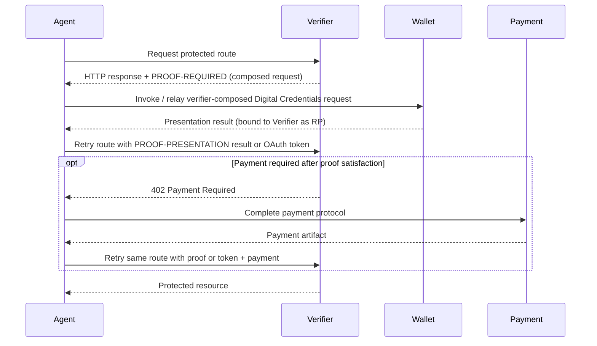
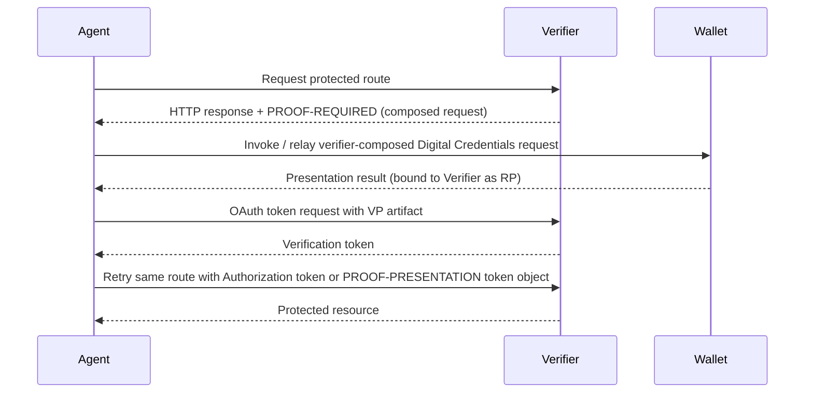

x401: HTTP Proof Requirement Protocol
==================

Status: [[badge: Draft]]

Version: 0.2.0

Latest Draft: https://x401.proof.com/spec/latest/

Previous Version: https://x401.proof.com/spec/0.1.0/

Editors:
~ [Daniel Buchner](https://www.linkedin.com/in/dbuchner) - [Proof](https://proof.com)
~ [Bhushit Agarwal](https://www.linkedin.com/in/bhushitagarwal/) - [Circle](https://circle.com)

Contributors & Reviewers:
~ [Darren Louie](https://www.linkedin.com/in/darrenlouie) - [Proof](https://proof.com)
~ [Lee Campbell](https://github.com/leecam) - [Google](https://google.com)
~ [Tim Cappalli](https://www.linkedin.com/in/timcappalli/) - [Okta](https://okta.com)
~ [Nick Steele](https://www.linkedin.com/in/nickelsteele/) - [OpenAI](https://openai.com)
~ [Reema Bajwa](https://www.linkedin.com/in/reema-bajwa/) - [Google](https://google.com)
~ [Jacky Lao](https://www.linkedin.com/in/jackylao/) - [Lightspark](https://www.lightspark.com/)
~ [Oliver Terbu](https://www.linkedin.com/in/oliver-terbu/) - [MATTR](https://mattr.global/)
~ [Tobias Looker](https://www.linkedin.com/in/tplooker/) - [MATTR](https://mattr.global/)
~ [Gareth Oliver](https://www.linkedin.com/in/gareth-oliver-1231b481/) - [Google](https://google.com)
~ [Adam Lemmon](https://www.linkedin.com/in/adamjlemmon/) - [Proof](https://proof.com)

Participate:
~ [GitHub repo](https://github.com/proof/x401)
~ [File an issue](https://github.com/proof/x401/issues)
~ [Commit history](https://github.com/proof/x401/commits/main)

------------------------------------

## Abstract

x401 defines an HTTP-based, route-scoped proof requirement protocol for requiring credential-based proof before access to a protected resource is granted.

x401 uses:

- the **`PROOF-REQUIRED` HTTP header field** to carry proof requirements
- the **`PROOF-PRESENTATION` HTTP header field** to carry proof presentations, presentation references, or reusable proof-satisfaction tokens
- the **`PROOF-RESPONSE` HTTP header field** to carry verifier response information, including x401 proof errors
- **HTTP status codes** to express the overall response semantics independently of x401 proof state
- the **W3C Digital Credentials API (DC API)** request shape as the carrier for the Verifier-composed presentation request, so the request can be executed by native credential wallet/handler methods or relayed to other wallets and remote services
- **OpenID for Verifiable Presentations (OpenID4VP)** over the DC API for the composed presentation request, using **Digital Credentials Query Language (DCQL)** to describe the credential requirements
- **OAuth 2.0** for optional exchange of a verified presentation for an access token
- the **DCQL `trusted_authorities`** the Verifier already places inside the request as the authoritative issuer constraint, and — for its dereferenceable types (`openid_federation`, `etsi_tl`) — as the acquisition and discovery hint an Agent can follow to find where qualifying credentials are issued
- **OpenID for Verifiable Credential Issuance (OpenID4VCI)** for resolving credential issuer metadata when the request's `trusted_authorities` resolve to OpenID4VCI issuers

The x401 payload carries a composed, valid Digital Credentials request authored by the Verifier. The Verifier authors the request and, in the RECOMMENDED signed mode, is its relying party. The request is carried in the `digital` member of the payload's `credential_requirements` — itself a `CredentialRequestOptions` value usable directly as the argument to native credential wallet/handler methods (`navigator.credentials.get(payload.credential_requirements)`) — so it can be executed directly, relayed to another web wallet or remote presentation service, or handed off for fully remote generation. This version of x401 specifies only the `digital` member; the container leaves room for other `navigator.credentials.get()` request types in future versions. The payload's other top-level members — such as OAuth token exchange metadata and reusable requirement identifiers — carry x401-specific values that are not yet expressible inside a native Digital Credentials request.

x401 is intentionally separate from payment protocols. When payment is required, it MUST be handled with **HTTP 402 Payment Required** and an appropriate payment protocol. x401 MUST NOT redefine payment semantics.

This document defines the x401 payload, processing rules, interoperability requirements, and examples for proof requirements with optional payment handling.

::: note Protocol Boundary
x401 defines proof requirement semantics only. When payment is required, implementations still use `402 Payment Required` and a separate payment protocol.
:::

## Introduction

HTTP provides a standard challenge mechanism for authentication via `401 Unauthorized` and `WWW-Authenticate`, but it does not define a general-purpose, machine-readable protocol for route-scoped proof requirements such as:

- proving personhood
- proving country of residency
- proving membership or accreditation
- proving entitlement issued by a specific issuer class
- proving organizational standing
- proving workload identity attributes

At the same time, OpenID4VP, DCQL, OAuth, OpenID4VCI, and the W3C Digital Credentials API define interoperable mechanisms for requesting presentations, evaluating credential requirements, invoking wallets, issuing access tokens, and issuing credentials, but they are not themselves an HTTP route proof requirement protocol.

x401 fills that gap by defining an HTTP-native wrapper that:

- signals proof requirements at the protected route
- carries x401 proof objects as base64url values in dedicated proof header fields
- carries a composed, valid Digital Credentials request, authored and signed by the Verifier, in the `digital` member of the payload's `credential_requirements`
- recommends a signed OpenID4VP request for the DC API — making the Verifier the relying party and binding the request to the Verifier independently of which surface invokes it — while allowing an unsigned request when the request must be fulfilled at an invocation origin the Verifier cannot declare in advance
- lets the [[ref: Agent]] execute the request through native credential methods, relay it to another wallet or remote service, or hand it off for fully remote generation and then acquire the result
- includes OAuth token exchange metadata for Agents that want a reusable access token after proving
- lets Agents discover where to acquire qualifying credentials by following the dereferenceable issuer pointers (`openid_federation`, `etsi_tl`) the Verifier already places in the request's DCQL `trusted_authorities`, without adding an x401-specific issuer list
- composes with, but does not subsume, payment protocols

In the typical flow, an [[ref: Agent]] receives an x401 proof requirement from a [[ref: Verifier]], obtains a presentation for the Verifier-composed [[ref: Presentation Request]] — by invoking the request through native credential methods, relaying it to a [[ref: Wallet]], or acquiring a remotely generated result — and retries the original protected route with the presentation result inline or by reference. The dereferenceable issuer pointers in the request's DCQL `trusted_authorities` can help the Agent discover where to acquire qualifying credentials, but the Verifier remains authoritative for issuer trust enforcement.

## Design Goals

The goals of x401 are:

1. Define a route-scoped proof requirement for HTTP resources.
2. Carry a composed, valid Digital Credentials request, authored by the Verifier, that can be executed by native credential wallet/handler methods.
3. Let the Verifier be the relying party for that request through a signed request, while allowing an unsigned request bound to the invoking origin and nonce when the invocation origin cannot be known in advance.
4. Preserve the Agent's ability to execute the request natively, relay it to another wallet or remote service, or hand it off for fully remote generation and then acquire and present the result.
5. Reserve the top level of the x401 payload, alongside the native request, for x401-specific values that are not yet expressible inside a native Digital Credentials request.
6. Reuse OpenID4VP over the DC API, DCQL, OAuth, and OpenID4VCI rather than redefining them.
7. Remain separate from payment semantics.
8. Allow issuer discovery and credential acquisition to follow the issuer constraints the Verifier already expresses in the request's DCQL `trusted_authorities`, without adding an x401-specific issuer list.
9. Support stateless verifier deployments without dictating how the Verifier achieves it.
10. Allow optional caller authentication, request signing, and delegation artifacts to compose with x401 without making any one agent identity or binding system mandatory.

## Non-Goals

x401 does not:

- define a new credential format
- replace OpenID4VP or the W3C Digital Credentials API
- replace OpenID4VCI
- redefine how a Digital Credentials request is composed, signed, or invoked
- mandate a single transport for delivering the composed request to a Wallet
- define a payment protocol
- require all Verifiers to maintain server-side session state
- require VP response encryption or any single agent authentication or binding mechanism

## Terminology

The key words **MUST**, **MUST NOT**, **REQUIRED**, **SHALL**, **SHALL NOT**, **SHOULD**, **SHOULD NOT**, **RECOMMENDED**, **NOT RECOMMENDED**, **MAY**, and **OPTIONAL** in this document are to be interpreted as described in RFC 2119 and RFC 8174.

[[def: Verifier]]:
~ The party protecting a resource or operation and requiring proof.

[[def: Agent]]:
~ The HTTP caller that requests a protected route, receives an x401 proof requirement, obtains a presentation for the Verifier-composed [[ref: Presentation Request]] — by invoking it through native credential methods, relaying it to a Wallet or remote service, or acquiring a remotely generated result — and retries the protected route. The Agent does not compose the presentation request and is not, by default, the relying party for it. A deployment MAY additionally bind the Agent to the request using an optional [[ref: Agent Identifier]].

[[def: Agent Identifier]]:
~ An optional identifier for the Agent that a Verifier MAY bind to the HTTP caller. This specification does not register a single Agent Identifier scheme; a Verifier that chooses to bind the Agent MUST define which schemes it accepts, including any accepted DID, HTTPS origin, domain-bound client identifier, or certificate-bound identifier schemes. See [Agent Binding Options](#agent-binding-options).

[[def: Holder]]:
~ The subject or entity that possesses credentials and can authorize a Wallet to present proof.

[[def: Wallet]]:
~ Software capable of receiving an OpenID4VP request through the Digital Credentials API or another transport and returning a presentation result authorized by a [[ref: Holder]].

[[def: Digital Credentials Request]]:
~ The composed, valid Digital Credentials request the Verifier places in the `digital` member of the payload's `credential_requirements`. It is a `DigitalCredentialRequestOptions` value (`{ "requests": [ ... ] }`) — the value the `digital` member of `navigator.credentials.get()` takes. Each entry is an OpenID4VP request for the DC API, signed (RECOMMENDED) or unsigned.

[[def: Presentation Request]]:
~ The Verifier-authored OpenID4VP request carried inside the [[ref: Digital Credentials Request]]. It identifies the credential requirement as `dcql_query` and carries the OpenID4VP `nonce`. When signed (RECOMMENDED), the Verifier is its relying party and it binds to the Verifier through the request signature, `client_id`, and `expected_origins`; when unsigned, it binds to the invoking origin and the `nonce`. See [Verifier Binding](#verifier-binding).

[[def: Presentation Result]]:
~ The result a Wallet returns for a [[ref: Digital Credentials Request]], shaped as `{ "protocol": ..., "data": ... }` as returned by the Digital Credentials API.

[[def: VP Artifact]]:
~ A retry artifact carrying a [[ref: Presentation Result]] — either inline or as a [[ref: Presentation Reference]] — together with the x401 metadata the Verifier needs to correlate proof fulfillment, encoded for use in a `PROOF-PRESENTATION` request header or OAuth token exchange.

[[def: Presentation Reference]]:
~ A by-reference form of the [[ref: VP Artifact]] that carries a URL the Verifier dereferences to fetch a [[ref: Presentation Result]] instead of carrying it inline, for presentations that exceed header size limits or are generated at a remote location.

[[def: Verification Token]]:
~ A verifier-issued, short-lived access token returned after successful proof verification and used by the [[ref: Agent]] on later protected-route requests so that the VP Artifact does not need to be repeated. A Verification Token can be used as the route's normal `Authorization` token when the deployment supports that model, or carried as an x401 Token Object in `PROOF-PRESENTATION` when the route already uses `Authorization` for existing application authentication.

[[def: x401 Token Object]]:
~ A JSON object carried as a base64url value in `PROOF-PRESENTATION` to pass a Verification Token without replacing the route's existing `Authorization` credentials.

[[def: x401 Payload]]:
~ The JSON object defined by this specification, UTF-8 encoded, and carried as a base64url value in the `PROOF-REQUIRED` header field.

[[def: x401 Error Object]]:
~ A JSON object carried as a base64url value in the `PROOF-RESPONSE` header field to describe why a presented proof failed or could not be processed.

## Protocol Overview

The x401 protocol is made up of four legs: a Verifier exposes identity proof requirements that gate access to a resource by composing a Digital Credentials request, the Agent obtains a presentation for that request, the Agent presents the result back to the Verifier, and the Agent may exchange that proof for a reusable Verification Token. The tabs below summarize each leg and link to the detailed section that defines the processing rules that pertain to them.

::: tabs

:: 1. Gated Resource

The Verifier declares a route-scoped proof requirement by returning a `PROOF-REQUIRED` header. The header carries the base64url-encoded x401 payload that defines the route's proof requirement; see [x401 Gated Resource Configuration](#x401-gated-resource-configuration) for details. The response status code describes the overall HTTP response and is not the x401 protocol carrier.

```http
HTTP/1.1 401 Unauthorized
PROOF-REQUIRED: <base64url-x401-payload>
Cache-Control: no-store
```

:: 2. Obtaining a Presentation

The Agent decodes the x401 payload and obtains a presentation for the Verifier-composed request carried in the `digital` member of the payload's `credential_requirements`. The Agent does not compose or alter the request; it invokes it through native credential methods, relays it to a Wallet or remote service, or acquires a remotely generated result; see [Obtaining a Presentation](#obtaining-a-presentation) for details. The `credential_requirements` object is directly usable as the argument to `navigator.credentials.get()`.

```js
const result = await navigator.credentials.get(payload.credential_requirements);
// result => { protocol: "openid4vp-v1-signed", data: { /* presentation result */ } }
```

:: 3. VP Presentation

After obtaining a presentation result, the Agent packages it as a VP Artifact for protected-route retry. The VP Artifact carries the Wallet-returned presentation result inline, or a reference the Verifier dereferences; see [Verifiable Presentation Delivery](#verifiable-presentation-delivery) for details.

```json
{
  "request_id": "proof-template-financial-customer-v1",
  "response": {
    "protocol": "openid4vp-v1-signed",
    "data": "<wallet-returned-presentation-result>"
  }
}
```

:: 4. Token Acquisition

The Agent can submit the same VP Artifact to the Verifier's OAuth token endpoint to obtain a reusable Verification Token. The token exchange uses fixed x401 token-exchange parameters and then the Agent retries protected routes with either an upgraded `Authorization` token or a `PROOF-PRESENTATION` proof-satisfaction token object; see [Access Token Acquisition](#access-token-acquisition) for details.

```http
POST /oauth/token HTTP/1.1
Host: bank.example.com
Content-Type: application/x-www-form-urlencoded

grant_type=urn:ietf:params:oauth:grant-type:token-exchange&
subject_token_type=urn:x401:params:oauth:token-type:vp_artifact&
subject_token=<base64url-vp-artifact-json>
```

:::

### Primary Flow

In the primary x401 flow, the [[ref: Agent]] is the HTTP caller and is assumed to have access to a [[ref: Wallet]], keys, credentials, or local capabilities needed to fulfill the proof requirement.

1. The [[ref: Agent]] requests a protected route.
2. The [[ref: Verifier]] determines that proof is required.
3. The [[ref: Verifier]] returns an HTTP response with:
   - `PROOF-REQUIRED: <base64url-x401-payload>`
4. The [[ref: Agent]] decodes the x401 payload and reads the composed [[ref: Digital Credentials Request]] in the `digital` member of `credential_requirements` and the OAuth token endpoint.
5. The [[ref: Agent]] obtains a [[ref: Presentation Result]] for `credential_requirements` without altering it, by one of:
   - invoking the request through a native credential method such as `navigator.credentials.get(payload.credential_requirements)`,
   - relaying the request to a Wallet or remote presentation service that can execute it, or
   - handing the request to a remote fulfillment surface and acquiring the generated result.
6. The chosen Wallet, handler, or service returns a presentation result bound per the request's mode — to the Verifier as relying party for a signed request, or to the invoking origin and nonce for an unsigned request.
7. The [[ref: Agent]] retries the same protected route that produced the x401 proof requirement with one of:
   - a [[ref: VP Artifact]] in a `PROOF-PRESENTATION` request header, carrying the presentation result inline or as a [[ref: Presentation Reference]],
   - a [[ref: Verification Token]] carried as an x401 Token Object in a `PROOF-PRESENTATION` request header, or
   - a [[ref: Verification Token]] in the route's normal `Authorization` request header when the deployment uses x401 proof satisfaction to upgrade or replace the route's ordinary authorization credential.
8. The [[ref: Verifier]] validates the VP Artifact or Verification Token, dereferencing a Presentation Reference when one is supplied.
9. If proof is satisfied and payment is not required or is already satisfied, the [[ref: Verifier]] returns the protected resource.
10. If proof is satisfied but payment remains unsatisfied, the [[ref: Verifier]] returns `402 Payment Required` with payment protocol details. After satisfying payment, the [[ref: Agent]] retries the same route with proof or token material and the payment artifact required by the selected payment protocol.



### Optional OAuth Token Exchange

An Agent MAY exchange a VP Artifact for a Verification Token before retrying the protected route. The token endpoint is supplied by the Verifier in the x401 payload.



The technical sections that follow are organized by the four main legs of the protocol: x401 gated resource configuration, obtaining a presentation, verifiable presentation delivery, and access token acquisition.

## x401 Gated Resource Configuration

The initial leg of the protocol defines how a protected HTTP resource declares what proof is required. The Verifier responds to the original protected-route request with a `PROOF-REQUIRED` header whose value contains the base64url-encoded x401 payload.

The requirement is route-scoped. If a representation includes gated and ungated material, this version of x401 does not define per-fragment requirements or separate requirement mapping inside the page. Fulfillment of the complete credential demand in the `PROOF-REQUIRED` payload satisfies the route's x401 gate.

```http
POST /accounts/applications HTTP/1.1
Host: bank.example.com
Accept: application/json

HTTP/1.1 401 Unauthorized
PROOF-REQUIRED: <base64url-x401-payload>
Cache-Control: no-store
```

### HTTP Semantics

HTTP status or condition | Meaning in a x401-capable deployment | Agent expectation
------------------------ | ------------------------------------ | ----------------
Any response with `PROOF-REQUIRED` | Proof is required, advertised, or not yet satisfied for the route | Decode the x401 payload from the `PROOF-REQUIRED` field value
Any response with `PROOF-RESPONSE` containing an x401 Error Object | A presented x401 proof failed or could not be processed | Decode the x401 error object and treat the x401 proof branch as failed
`2xx` with `PROOF-REQUIRED` | The HTTP response is otherwise successful, but the route includes x401-gated material or actions | Process the response normally and fulfill the route-scoped proof requirement when access to the gated material is needed
`4xx` with `PROOF-REQUIRED` | The route cannot be completed without proof | Fulfill the route-scoped proof requirement before retrying
`402 Payment Required` | Payment remains unsatisfied | Switch to the payment protocol

The x401 proof header fields are the x401 protocol carriers. HTTP status codes describe the overall response and do not, by themselves, define x401 proof state.

#### Status Code Independence

A server that requires proof for access to a protected resource, route, representation, or operation whose response would be changed as a whole by fulfilling a single set of proof requirements MUST return `PROOF-REQUIRED: <base64url-x401-payload>`. The `PROOF-REQUIRED` header is the authoritative carrier for an x401 proof requirement that gates the entire response.

The response MAY use any HTTP status code appropriate for the whole response. A Verifier can use a successful status code when the response body is still useful without proof, or a client or server error status when the requested operation cannot proceed until proof is satisfied.

Example:

```http
HTTP/1.1 200 OK
PROOF-REQUIRED: <base64url-x401-payload>
Cache-Control: no-store
```

An x401 proof requirement carried in `PROOF-REQUIRED` SHOULD NOT require the Agent to parse a response body in order to understand the proof requirement.

This specification does not carry x401 proof requirements in `WWW-Authenticate`. A protected route may already use that header for an existing HTTP authentication scheme, and combining multiple schemes — whether through comma-separated field values or duplicate header lines — is not consistently or well handled by common HTTP servers, proxies, client libraries, and middleware. Carrying x401 proof requirements in a dedicated `PROOF-REQUIRED` field avoids those interoperability gaps and lets x401 compose with any existing `WWW-Authenticate`-based authentication without contention.

#### 402 for Payment

A server that requires payment MUST use `402 Payment Required` and MUST NOT overload x401 to represent payment as proof.

Payment metadata MAY be declared in a x401 payload for informational purposes when payment may also be required, but payment satisfaction itself remains governed by the payment protocol used with `402`.

#### x401 Error for Failed Policy Satisfaction

If an Agent presents a proof artifact that is structurally valid but does not satisfy the Verifier's policy, the Verifier SHOULD return a `PROOF-RESPONSE: <base64url-x401-error-object>` header. The x401 Error Object is the protocol-specific indication of failure for x401 exchanges. The HTTP response status remains independent and describes the overall response.

Examples include:

- credential from an untrusted issuer
- credential does not satisfy predicates
- expired or revoked credential
- presentation is not bound as the request mode requires (wrong relying party, audience, or invoking origin)
- nonce is not one the Verifier issued, or is expired or replayed
- insufficient assurance level

### Proof Header Fields

The proof header fields carry x401 protocol objects. This specification uses "x401 proof requirement" for the overall route-gating declaration carried in `PROOF-REQUIRED`.

#### Header Syntax

Each x401 proof header field carries exactly one base64url-encoded UTF-8 JSON object. The header field name identifies the protocol leg, so x401 does not use an action keyword inside a shared carrier header.

Header field names are shown in uppercase for consistency with the examples. As HTTP field names, they are case-insensitive.

```text
PROOF-REQUIRED: <base64url-json>
PROOF-PRESENTATION: <base64url-json>
PROOF-RESPONSE: <base64url-json>
```

The defined x401 proof header fields are:

Header field | Direction | Decoded payload
------------ | --------- | ---------------
`PROOF-REQUIRED` | Verifier to Agent | [[ref: x401 Payload]]
`PROOF-PRESENTATION` | Agent to Verifier | [[ref: VP Artifact]] or [[ref: x401 Token Object]]
`PROOF-RESPONSE` | Verifier to Agent | x401 response information, including [[ref: x401 Error Object]]

The encoded value MUST be base64url-encoded UTF-8 JSON using the URL and filename safe alphabet defined by RFC 4648 Section 5 without padding. The decoded value MUST be a single JSON object.

When `PROOF-PRESENTATION` carries a VP Artifact, the request is a direct proof presentation. When it carries an x401 Token Object, the request is presenting a reusable proof-satisfaction token issued after prior verification.

`PROOF-RESPONSE` is the Verifier-to-Agent response information channel for x401-specific results and diagnostics. This specification defines the x401 Error Object for failed proof presentation or token processing. Deployments MAY define additional response objects for accepted proof state, token metadata, or other x401-specific return information.

A sender MUST NOT generate more than one field line with the same x401 proof header name in the same HTTP message. A sender MUST NOT combine multiple x401 protocol objects in a single proof header using commas or other list syntax. If a recipient receives multiple field lines for the same proof header, or receives a proof header value containing a comma-separated list of messages, it MUST treat that proof header as invalid.

A response SHOULD NOT contain both `PROOF-REQUIRED` and `PROOF-RESPONSE` unless the response both reports verifier response information and intentionally advertises a fresh proof requirement for a subsequent attempt. A request SHOULD NOT contain more than one `PROOF-PRESENTATION` value.

When browser-based JavaScript needs to read `PROOF-REQUIRED` or `PROOF-RESPONSE` from a cross-origin response, the response needs CORS exposure for those fields. When browser-based JavaScript sends `PROOF-PRESENTATION` cross-origin, the server needs to allow the `PROOF-PRESENTATION` request header through CORS preflight.

### x401 Payload

A x401 payload is a single JSON object encoded in the `PROOF-REQUIRED` header field.

The payload SHOULD remain compact. Sensitive route state SHOULD be omitted, stored server-side, or carried only inside verifier-protected nonce state.

#### Top-Level Members

```json
{
  "scheme": "x401",
  "version": "0.2.0",
  "credential_requirements": {},
  "oauth": {},
  "request_id": "...",
  "satisfied_requirements": [],
  "payment": {}
}
```

The top level of the x401 payload is itself the envelope: the native, standard credential request is the `credential_requirements` member — a `CredentialRequestOptions` value whose `digital` member carries the Digital Credentials request — and the remaining x401-specific members, which are not yet expressible inside a native credential request, sit alongside it so the Agent and Verifier can polyfill their use.

#### Member Definitions

Name | Definition
---- | ----------
`scheme` | REQUIRED. Value MUST be the string `"x401"`.
`version` | REQUIRED. The x401 payload version.
`credential_requirements` | REQUIRED. The Verifier-composed credential request, a `CredentialRequestOptions` value. This version of x401 specifies its `digital` member, the composed [[ref: Digital Credentials Request]]. See [Credential Requirements](#credential-requirements).
`oauth` | REQUIRED. OAuth token exchange metadata for obtaining a reusable Verification Token. See [OAuth Members](#oauth-members).
`request_id` | OPTIONAL. A stable verifier-defined identifier for the proof template, as an Agent-visible hint. See [Reusable Requirement Hints](#reusable-requirement-hints).
`satisfied_requirements` | OPTIONAL. Stable verifier-defined identifiers for the reusable proof requirements this proof would satisfy, as an Agent-visible reuse hint. See [Reusable Requirement Hints](#reusable-requirement-hints).
`return_uri` | OPTIONAL. An `https` URL added by a relaying intermediary (never by the Verifier) telling a remote handler where to deliver the presentation result. See [Relayed Delivery to a Remote Handler](#relayed-delivery-to-a-remote-handler).
`payment` | OPTIONAL. Describes that payment is additionally required, without replacing `402` semantics.

The credential requirement, the OpenID4VP `nonce`, and the request expiry all live inside the request in `credential_requirements.digital`; x401 does not duplicate them at the payload level. Of the payload-level members, only `credential_requirements` and `oauth` are load-bearing; `request_id` and `satisfied_requirements` are optional hints and optimizations. Issuer constraints and any acquisition pointers live inside the request, in its DCQL `trusted_authorities`, not at the payload level.

### Credential Requirements

The `credential_requirements` member is the Verifier-composed credential request: a `CredentialRequestOptions` value, usable directly as the argument to `navigator.credentials.get()`. This version of x401 specifies a single member, `digital`, which carries the [[ref: Digital Credentials Request]]. The object is structured so that other `navigator.credentials.get()` request types MAY be specified in future versions of x401; this version defines processing only for `digital` (see [Additional Credential Request Types](#additional-credential-request-types)). The Verifier authors the request; in the RECOMMENDED signed mode it also signs the request and is its relying party (see [Verifier Binding](#verifier-binding)).

#### General Structure

```json
{
  "credential_requirements": {
    "digital": {
      "requests": [
        {
          "protocol": "openid4vp-v1-signed",
          "data": {
            "request": "eyJhbGciOiJFUzI1NiIsInR5cCI6Im9hdXRoLWF1dGh6LXJlcStqd3QifQ..."
          }
        }
      ]
    }
  },
  "oauth": {
    "token_endpoint": "https://bank.example.com/oauth/token"
  },
  "request_id": "proof-template-financial-customer-v1",
  "satisfied_requirements": [
    "urn:example:x401:satisfaction:financial-customer:v1"
  ]
}
```

The `digital` member is a `DigitalCredentialRequestOptions` value — the value the `digital` member of `navigator.credentials.get()` takes. Each entry in its `requests` array is an OpenID4VP request for the DC API. The example below uses the RECOMMENDED signed form, whose JAR carries the OpenID4VP request the Verifier authored — RP identity and freshness live there, not in any x401-specific field. Decoded for readability, a typical JAR payload is:

```json
{
  "response_type": "vp_token",
  "response_mode": "dc_api",
  "client_id": "x509_san_dns:bank.example.com",
  "expected_origins": ["https://bank.example.com"],
  "nonce": "uX7Vq3mZJH6MeN0qz2L7SQ",
  "dcql_query": {
    "credentials": [
      {
        "id": "financial_customer",
        "format": "jwt_vc_json",
        "meta": {
          "type_values": ["FinancialCustomerCredential"]
        },
        "claims": [
          {
            "path": ["credentialSubject", "assurance_level"],
            "values": ["VC-AL2", "VC-AL3"]
          }
        ]
      }
    ]
  },
  "client_metadata": {},
  "exp": 1746557100
}
```

The `credential_requirements.digital` value is a `DigitalCredentialRequestOptions`. The credential requirement (`dcql_query`), the OpenID4VP `nonce`, and the request expiry (`exp`) all live inside the request; x401 does not restate or duplicate them at the payload level, and adds no expiry member of its own.

#### Request Members

This version of x401 specifies the `digital` member of `credential_requirements`. It is a `DigitalCredentialRequestOptions` with the following members:

Name | Definition
---- | ----------
`digital` | REQUIRED in this version. The composed [[ref: Digital Credentials Request]], a `DigitalCredentialRequestOptions` carrying the `requests` array below.
`digital.requests` | REQUIRED. A non-empty array of Digital Credentials request entries. A Verifier MAY include more than one entry (for example, offering different credential formats) for a Wallet, handler, or remote service to select among. Every entry MUST be a valid OpenID4VP request for the DC API.
`digital.requests[].protocol` | REQUIRED. The DC API protocol identifier. For this version of x401 the value MUST be `"openid4vp-v1-signed"` (RECOMMENDED) or `"openid4vp-v1-unsigned"`. See [Verifier Binding](#verifier-binding) for the trade-off.
`digital.requests[].data` | REQUIRED. The protocol-specific request data. For `openid4vp-v1-signed`, an object carrying the signed OpenID4VP request (a JWT-Secured Authorization Request); for `openid4vp-v1-unsigned`, the OpenID4VP request parameters directly.

### OAuth Members

Name | Definition
---- | ----------
`token_endpoint` | REQUIRED. OAuth 2.0 token endpoint where the Agent can exchange a VP Artifact for a Verification Token.
`audience` | OPTIONAL. OAuth token exchange `audience` value the Agent should request.
`resource` | OPTIONAL. OAuth token exchange `resource` value the Agent should request.

The x401 OAuth profile fixes `grant_type`, `subject_token_type`, and Bearer token usage. These values MUST NOT be repeated in the x401 payload.

### Reusable Requirement Hints

`request_id` and `satisfied_requirements` are OPTIONAL, Agent-visible hints that support cross-route token reuse. They are not inputs to proof validation or token issuance — the Verifier determines what a proof satisfies from its own policy. See [Reuse Across Routes](#reuse-across-routes).

Name | Definition
---- | ----------
`request_id` | OPTIONAL. A stable verifier-defined identifier for the proof template. It lets an Agent recognize that two routes ask for the same proof.
`satisfied_requirements` | OPTIONAL. Stable verifier-defined identifiers for the reusable proof requirements this proof would satisfy, letting an Agent decide whether an existing Verification Token may apply to a later route.

### Payload Example

::: example x401 Payload Example
```json
{
  "scheme": "x401",
  "version": "0.2.0",
  "credential_requirements": {
    "digital": {
      "requests": [
        {
          "protocol": "openid4vp-v1-signed",
          "data": {
            "request": "eyJhbGciOiJFUzI1NiIsInR5cCI6Im9hdXRoLWF1dGh6LXJlcStqd3QifQ..."
          }
        }
      ]
    }
  },
  "oauth": {
    "token_endpoint": "https://bank.example.com/oauth/token"
  },
  "request_id": "proof-template-financial-customer-v1",
  "satisfied_requirements": [
    "urn:example:x401:satisfaction:financial-customer:v1"
  ]
}
```
:::

### Verifier State and Stateless Operation

Because the Verifier authors, signs, and validates its own request, freshness, replay protection, and correlation between a returned presentation and the issued request are internal Verifier concerns. x401 places no requirements on how the Verifier composes the OpenID4VP `nonce`, recognizes a returned presentation as one it requested, or recovers route and policy context. The freshness and replay properties of the `nonce` are governed by OpenID4VP.

::: note Stateless operation
A Verifier MAY operate statelessly. Because the OpenID4VP `nonce` is the value echoed back and cryptographically bound in the returned presentation, a Verifier MAY make the `nonce` a verifier-protected, self-contained value that encodes the route, method, policy, and expiry it needs to validate the retry without server-side storage. How that value is constructed, whether one-time-use replay protection is enforced with a small shared cache, and how any response-encryption decryption key is managed are deployment decisions left to the implementer.
:::

### Credential Acquisition Guidance

x401 does not define a separate issuer list. The issuers a Verifier accepts are already expressed inside the request, as the DCQL `trusted_authorities` of each credential query in `credential_requirements.digital`. That same constraint is the acquisition hint: when an Agent does not already hold a qualifying credential, it discovers where to obtain one by resolving the `trusted_authorities` entries — for the entry types that are dereferenceable. This reuses the Verifier's authoritative issuer constraint as the discovery surface, so the discovery path and the enforcement path cannot diverge.

Each `trusted_authorities` entry is a `{ "type": ..., "values": [...] }` object. How an Agent can resolve it for acquisition depends on its `type`:

- **`openid_federation`** — each value is an HTTPS Entity Identifier. The Agent resolves it as an OpenID Federation entity by fetching `<value>/.well-known/openid-federation`. If the entity's `metadata` carries an `openid_credential_issuer` entry, that entity is itself a credential issuer and its OpenID4VCI metadata is published in-band. If the entity is a federation anchor or intermediate, the Agent walks the subordinate listing and trust chain to find subordinate entities that publish `openid_credential_issuer` metadata, validating the chain back to the anchor named in `values`. This is the fully resolvable path from issuer constraint to issuance endpoint.
- **`etsi_tl`** — each value identifies an ETSI TS 119 612 Trusted List. The Agent MAY fetch and parse the list, enumerate the trust service providers and services whose service type matches the required credential, and follow a service's supply point to locate an issuer. Whether a listed service exposes an OpenID4VCI issuance endpoint is an ecosystem convention, not a guarantee of this format, so acquisition from `etsi_tl` is best-effort.
- **`aki`** — each value is an Authority Key Identifier: an opaque issuer key identifier with no resolution mechanism. It constrains acceptable issuers but provides no acquisition pointer. For a request whose only issuer constraint is `aki`, x401 defines no native acquisition path; the Agent must already hold a qualifying credential or resolve the issuer out of band.

When an entry resolves to one or more OpenID4VCI Credential Issuer Identifiers, the Agent resolves issuer metadata using the OpenID4VCI issuer metadata discovery rules and drives issuance against the discovered issuer. See OpenID4VCI Section 12.2.2: <https://openid.net/specs/openid-4-verifiable-credential-issuance-1_0-final.html>.

Acquisition guidance is advisory and never decides validity. The Verifier enforces issuer trust during proof validation against the `trusted_authorities` in the request it issued and its own policy, independently of how — or whether — the Agent used these pointers to acquire a credential.

### Payment Object

When payment may also be required, a x401 payload MAY declare the existence of that additional payment requirement. This is to help avoid situations where the user is not willing or able to pay, but does not find out about the payment requirement until after they have already disclosed their credential(s), resulting in needless sharing of identity information without achieving the outcome the user intended.

The payment object is informational and orchestration-oriented only. It does not replace `402 Payment Required`.

The presence of a `payment` member does not create a distinct x401 proof flow. The Agent completes the same proof steps described in the base flow. If the Verifier accepts the proof but payment remains unsatisfied, the Verifier uses `402 Payment Required` and the selected payment protocol to complete payment before granting access.

#### Example

```json
{
  "required": true,
  "scheme_hint": "x402",
  "notes": "Payment is required after proof is satisfied."
}
```

::: warning payment hint warning
There is good reason to include hints about payment requirements, but because it could result in replication of nearly everything 402-related protocols define, the payment hint has been constrained to a boolean to allow the community to drive how much payment requirement information to include.
:::

#### Members

Name | Definition
---- | ----------
`required` | OPTIONAL. Boolean indicating whether payment is additionally required.
`scheme_hint` | OPTIONAL. A hint naming the expected payment protocol.
`notes` | OPTIONAL. Human-readable notes.

If proof is accepted but payment is still unsatisfied, the Verifier responds with `402 Payment Required` using the payment protocol indicated by the verifier.

## Obtaining a Presentation

This leg defines how the Agent obtains a presentation for the Verifier-composed request carried in the `digital` member of the payload's `credential_requirements`. The Verifier authored the request; the Agent does not compose it and is not, by default, its audience. The Agent's task is to get the request executed and to acquire the resulting [[ref: Presentation Result]].

An Agent obtains a presentation by one of the following, all of which carry the same Verifier-composed request unchanged:

1. **Native invocation.** In an environment with the Digital Credentials API, the Agent invokes the request directly:

   ```js
   const result = await navigator.credentials.get(payload.credential_requirements);
   // result => { protocol, data }
   ```

   A native platform credential handler MAY be used in place of the Web API where an equivalent mechanism exists.

2. **Relay to a remote handler.** The Agent forwards the request to a remote handler — a web wallet or service that produces the presentation without invoking the Digital Credentials API itself — and the handler returns the result to a URL the Agent supplies. See [Relayed Delivery to a Remote Handler](#relayed-delivery-to-a-remote-handler).

3. **Remote, out-of-band generation.** When the Agent's environment cannot invoke the request directly — for example, a consumer AI client without a credential handler — the request can be handed to a remote fulfillment surface (such as a verifier-hosted page) that invokes the Digital Credentials API in its own context and generates the presentation. The Agent then acquires the result and replays the protected route. See [Remote and Out-of-Band Fulfillment](#remote-and-out-of-band-fulfillment).

In every case the resulting presentation is bound per the request's mode and transport — to the Verifier as relying party for a signed request, or to the invoking origin and the Verifier's `nonce` for an unsigned request (see [Verifier Binding](#verifier-binding)) — not to the Agent.

### Composed Request Invariants

The composed request is authored and signed by the Verifier. The Agent treats it as opaque:

1. The Agent MUST NOT modify any entry in `credential_requirements`. The request signature binds its contents, so any modification invalidates it.
2. When `credential_requirements.digital.requests` contains more than one entry, the Agent MAY narrow them to entries whose `protocol` or credential formats the chosen Wallet or handler implements, and MAY pass the entries through unchanged; which entry is ultimately used is determined by the Wallet or handler matching the request against available credentials, not chosen up front by the Agent.
3. The Agent MUST arrange to acquire the [[ref: Presentation Result]] returned for the request, whether it invokes the request itself, relays it, or acquires a remotely generated result.

A Verifier composing `credential_requirements.digital`:

1. MUST make each entry a valid OpenID4VP request for the Digital Credentials API, using `protocol: "openid4vp-v1-signed"` (RECOMMENDED) or `protocol: "openid4vp-v1-unsigned"`.
2. SHOULD use a signed request and set its `client_id` and `expected_origins`. A signed request lets the Wallet authenticate the Verifier, binds the presentation's audience to the Verifier's identity, and lets the Verifier pre-authorize the invocation origin; see [Verifier Binding](#verifier-binding).
3. MAY use an unsigned request when it needs the request fulfilled at an invocation origin it cannot declare in advance — for example, when the Agent invokes the request directly in its own context or relays it to an arbitrary surface. An unsigned request binds the presentation to the invoking origin and the Verifier's `nonce` rather than to a signed Verifier identity, with the trade-offs described in [Verifier Binding](#verifier-binding).
4. MAY request response encryption (for example, a `dc_api.jwt` response mode with encryption keys in `client_metadata`) or omit it. Response encryption is OPTIONAL in x401.

x401 does not restate the field-level rules for composing, signing, or invoking a Digital Credentials request; those are defined by the W3C Digital Credentials API and by OpenID4VP for the DC API. x401 requires only that `credential_requirements.digital` is a valid `DigitalCredentialRequestOptions` whose entries are valid OpenID4VP requests for the DC API; the Verifier validates whichever binding its chosen request mode provides.

The request's DCQL `trusted_authorities` can help Agents discover where to acquire acceptable credentials, but they never delegate verification behavior to the Agent, and discovery does not decide validity — the request's `dcql_query` and `trusted_authorities` do, as enforced by the Verifier. When a `trusted_authorities` entry resolves to OpenID4VCI issuers, Agents resolve those issuers using OpenID4VCI issuer metadata discovery; see [Credential Acquisition Guidance](#credential-acquisition-guidance).

### Relayed Delivery to a Remote Handler

Native invocation returns the presentation through the `navigator.credentials.get()` call, so it needs no return channel. When an intermediary — for example, an MCP tool or other Agent — instead hands the request to a **remote handler** (a web wallet or service that produces the presentation without invoking the Digital Credentials API itself), two things must be supplied that the Verifier cannot know: where the result is returned, and how a non-DC-API handler is expected to process a Digital Credentials request. The intermediary forwards the request unchanged and adds only the return channel.

#### Return Channel

An intermediary that relays the x401 payload to a remote handler MUST add a `return_uri` member to the payload it forwards. `return_uri` is an `https` URL the handler delivers the [[ref: Presentation Result]] to; it is supplied by the relaying intermediary, never by the Verifier, and SHOULD be unguessable, short-lived, single-use, and controlled by the intermediary. The handler returns the result by sending an HTTP `POST` of the `{ "protocol": ..., "data": ... }` Presentation Result to `return_uri`. The intermediary then packages that result into a VP Artifact (inline or as a [[ref: Presentation Reference]]) and retries the protected route.

```json
{
  "scheme": "x401",
  "version": "0.2.0",
  "credential_requirements": { "digital": { "requests": [ { "protocol": "openid4vp-v1-signed", "data": { "request": "eyJ..." } } ] } },
  "oauth": { "token_endpoint": "https://bank.example.com/oauth/token" },
  "return_uri": "https://mcp.example/x401/return/9f1c2a"
}
```

#### Handler Processing

The intermediary passes `credential_requirements` to the handler unchanged; the handler is not asked to disassemble it, nor is it told which entry to use. It evaluates the request the way the Digital Credentials API would and returns a presentation for whichever entry it can satisfy. A remote handler that does not invoke the Digital Credentials API:

1. MUST consider the `requests[]` entries whose `protocol` and credential formats it implements, and among those, MUST attempt to satisfy each entry's `dcql_query` — including any `credential_sets` / `claim_sets` alternatives within it — against the credentials available to it, with Holder selection where applicable. Which entry is used is the *outcome* of this matching, not a prior choice; an entry is usable only if a held credential satisfies its query.
2. For a satisfiable entry, MUST read the OpenID4VP request from its `data` — the claims of the signed request object for `openid4vp-v1-signed`, or the request parameters directly for `openid4vp-v1-unsigned` — and produce a presentation that satisfies that `dcql_query`, bound to its `nonce`. It honors `client_metadata` for accepted formats and any response-encryption key, and, for a signed request, binds the presentation's audience to the request's `client_id`.
3. MUST treat the Digital Credentials API transport members as not applicable to relayed delivery: it does not return through `response_mode: dc_api`/`dc_api.jwt` (it returns to `return_uri` instead) and does not enforce `expected_origins` (there is no invoking Web origin).
4. MUST NOT weaken or alter the `dcql_query` or `nonce`, and MUST deliver the resulting [[ref: Presentation Result]] to `return_uri`. If it can satisfy no entry, it returns no presentation and SHOULD signal that failure to the intermediary rather than returning a partial or substitute result.

This matching, credential discovery, and Holder selection follow the same OpenID4VP and DCQL rules a Wallet applies under the Digital Credentials API; x401 does not redefine them.

Because relayed delivery does not go through a Web origin, `expected_origins` is not enforced. A signed request still binds the presentation's audience to the Verifier through its `client_id`, so signed requests are RECOMMENDED for relayed delivery — they preserve Verifier audience binding across the relay, losing only origin pre-authorization. An unsigned request has no `client_id` and so binds only to the `nonce`. A Verifier that supports relayed delivery validates the returned presentation by its `nonce` and, for a signed request, its `client_id`, accepting that origin pre-authorization was not enforced — the weaker-binding case described in [Verifier Binding](#verifier-binding).

#### Composing a Request for Both Native and Relayed Fulfillment

A Verifier that may have its request fulfilled either natively — invoked through `navigator.credentials.get()` by a Wallet enforcing the Digital Credentials API — or by a remote handler that parses the request and generates a presentation manually MUST compose the request so it is self-contained and verifiable by a party with no prior relationship and no browser context. The governing test is: *could a Wallet that has never interacted with this Verifier verify the request and produce a correctly bound presentation from the request bytes alone?* A request composed only for the native path can silently fail this test even though a DC-API Wallet accepts it. To satisfy both paths, a Verifier:

1. SHOULD use a signed request (`openid4vp-v1-signed`). It is the only request mode that carries any Verifier binding across a relay (audience via `client_id`), and it is equally valid natively. An unsigned request is fulfillable by a remote handler but binds only to the `nonce`; see [Verifier Binding](#verifier-binding).
2. MUST make its identity and request-signing key resolvable from the request alone. The Verifier SHOULD embed its signing certificate chain in the request JWS `x5c` header, or use a `client_id` whose key material is publicly resolvable (for example a `did:` or `https:` scheme), so a handler with no prior relationship can verify the signature and confirm it matches `client_id` offline. A Verifier MUST NOT rely on a `client_id` scheme or key whose resolution depends on the invoking Web origin or on prior DC-API interaction, because neither exists on the relayed path.
3. MUST carry every input a fulfiller needs inside the request object: the `nonce`, the `dcql_query` (including any `credential_sets` / `claim_sets` alternatives), the accepted formats and any response-encryption key in `client_metadata`, and the `exp`. A remote handler reads these directly from the request `data` — the signed request object's claims for a signed request — not from any API surface, so a value referenced only through the DC-API or a same-origin session is unavailable to it.
4. SHOULD still set the Digital Credentials API transport members — `response_mode` (`dc_api` / `dc_api.jwt`) and `expected_origins` — for the native path, but MUST NOT make correct processing depend on them. A remote handler treats them as not applicable (it returns to `return_uri` and there is no invoking origin to pre-authorize), so a request whose only Verifier binding is `expected_origins` degrades to `nonce`-only when relayed.
5. SHOULD, when response confidentiality through the intermediary or `return_uri` host is required, supply a response-encryption key in `client_metadata` rather than relying on the `dc_api.jwt` response mode. The encryption key is honored on both paths, independent of `response_mode`; the transport-bound encryption of `dc_api.jwt` is not used when the result is delivered to `return_uri`.
6. SHOULD size `exp` to accommodate relay latency and Holder interaction, which take longer than a same-device interactive flow, and SHOULD rely on the freshness and uniqueness of the `nonce` for replay protection rather than on a tight `exp`; see [Verifier State and Stateless Operation](#verifier-state-and-stateless-operation).
7. SHOULD use signature algorithms and credential formats an arbitrary Wallet can verify and produce, and SHOULD NOT over-constrain `client_metadata` to formats only a specific native Wallet implements.

A request composed this way is fulfillable on either path with no change: the native Wallet enforces `expected_origins` and returns through the DC-API, while the remote handler ignores those transport members, verifies the Verifier from the embedded key material, and returns the same `{ protocol, data }` result to `return_uri`. In both cases the Verifier validates the returned presentation by its `nonce` and the binding its request mode provides.

## Verifiable Presentation Delivery

This phase of the protocol defines how the Agent packages the Wallet's presentation result and presents it back to the Verifier. The Agent either retries the protected route directly with a VP Artifact or uses that same VP Artifact in the OAuth token exchange described in the next leg.

```http
POST /accounts/applications HTTP/1.1
Host: bank.example.com
PROOF-PRESENTATION: <base64url-vp-artifact-json>
```

### VP Artifact

After obtaining a [[ref: Presentation Result]], the Agent packages it as a VP Artifact for protected-route retry or OAuth token exchange. The VP Artifact carries the presentation result either inline or as a [[ref: Presentation Reference]].

#### General Structure

An inline VP Artifact carries the Digital Credentials API result `{ protocol, data }` directly:

```json
{
  "request_id": "proof-template-financial-customer-v1",
  "response": {
    "protocol": "openid4vp-v1-signed",
    "data": "<wallet-returned-presentation-result>"
  }
}
```

A by-reference VP Artifact carries a URL the Verifier dereferences to fetch the presentation result, for results that exceed header size limits or are generated at a remote location:

```json
{
  "request_id": "proof-template-financial-customer-v1",
  "presentation_uri": "https://bank.example.com/.well-known/x401/presentations/abc123",
  "expires_at": "2026-05-06T18:50:00Z"
}
```

#### Members

Name | Definition
---- | ----------
`response` | REQUIRED unless `presentation_uri` is present. The [[ref: Presentation Result]] returned by the Wallet, as the `{ protocol, data }` object produced by the Digital Credentials API.
`presentation_uri` | REQUIRED unless `response` is present. An HTTPS URL the Verifier dereferences with `GET` to fetch the [[ref: Presentation Result]]. The Verifier MUST issue a unique `presentation_uri` value for each presentation and MUST NOT reuse one across presentations. See [Presentation by Reference](#presentation-by-reference).
`expires_at` | OPTIONAL. RFC 3339 time after which the `presentation_uri` is no longer valid.
`request_id` | OPTIONAL. The x401 `request_id`, when present.
`agent_id` | OPTIONAL. An [[ref: Agent Identifier]] for the HTTP caller, when the deployment binds the Agent to the retry. See [Agent Binding Options](#agent-binding-options).

A VP Artifact MUST contain exactly one of `response` or `presentation_uri`.

The Verifier MUST NOT treat the `request_id` or `agent_id` values inside the VP Artifact as authoritative by themselves. They are carried so the Verifier can correlate the retry. Correlation between the presentation and the issued request is established by the OpenID4VP `nonce` echoed inside the presentation result. The Verifier remains responsible for validating the presentation binding and, when it binds the Agent, authenticating the Agent Identifier.

### Presentation by Reference

A presentation result can be larger than an HTTP header field comfortably carries, and a remotely generated result may not be held by the Agent at all. For these cases the VP Artifact MAY carry a `presentation_uri` instead of an inline `response`. The Verifier dereferences the URL to obtain the same `{ protocol, data }` presentation result it would otherwise have received inline.

When a VP Artifact carries `presentation_uri`:

1. The `presentation_uri` MUST be an `https` URL.
2. The Verifier MUST issue a unique `presentation_uri` for each presentation and MUST NOT reuse a URI value across presentations. Uniqueness per presentation is what lets the Verifier treat the reference as single-use and bind it to one retry.
3. The Verifier fetches the presentation result with an HTTP `GET` and processes it exactly as if it had been supplied inline as `response`. The fetched presentation is self-authenticating — it is validated against the issued request's `nonce` and the binding its request mode provides, like any other — so a substituted or tampered result is rejected by normal proof validation without a separate integrity digest.
4. The reference SHOULD be short-lived and scoped to the route and retry it serves.

This same mechanism lets a remote fulfillment surface generate a presentation, publish it at a `presentation_uri`, and let the Agent replay the protected route with only the reference. See [Remote and Out-of-Band Fulfillment](#remote-and-out-of-band-fulfillment).

### x401 Error Object

When a Verifier reports that an x401 proof presentation failed or could not be processed, it returns a `PROOF-RESPONSE` header whose payload is a base64url-encoded x401 Error Object.

#### General Structure

```json
{
  "scheme": "x401",
  "version": "0.2.0",
  "error": "invalid_presentation",
  "error_description": "The presentation did not satisfy the route proof requirement.",
  "request_id": "proof-template-financial-customer-v1"
}
```

#### Members

Name | Definition
---- | ----------
`scheme` | REQUIRED. Value MUST be the string `"x401"`.
`version` | REQUIRED. The x401 error object version.
`error` | REQUIRED. A verifier-defined error code. The value SHOULD be a short ASCII token suitable for logs and programmatic handling.
`error_description` | OPTIONAL. Human-readable diagnostic text.
`error_uri` | OPTIONAL. HTTPS URL identifying documentation for the error.
`request_id` | OPTIONAL. The x401 `request_id`, when the error can be correlated to a proof template.

The x401 Error Object describes the x401 proof branch only. The HTTP status code continues to describe the overall response.

### x401 Token Object

When an Agent has a Verification Token and the protected route already uses the `Authorization` request header for existing application authentication, the Agent can pass the Verification Token as an x401 Token Object in a `PROOF-PRESENTATION` header. This allows existing application credentials and x401 proof satisfaction to travel on the same request without overloading `Authorization`.

#### General Structure

```json
{
  "scheme": "x401",
  "version": "0.2.0",
  "token_type": "Bearer",
  "access_token": "<x401-verification-token>"
}
```

#### Members

Name | Definition
---- | ----------
`scheme` | REQUIRED. Value MUST be the string `"x401"`.
`version` | REQUIRED. The x401 token object version.
`token_type` | REQUIRED. The token type of the supplied Verification Token. For Verification Tokens defined by this specification, the value is `"Bearer"`.
`access_token` | REQUIRED. The opaque or structured [[ref: Verification Token]] value issued to the [[ref: Agent]].

The x401 Token Object carries proof satisfaction only. It does not replace the route's ordinary authorization credentials unless the deployment explicitly defines the Verification Token as an upgraded or replacement application token.

### Route Retry Headers

After receiving an x401 proof requirement and obtaining a presentation result, the Agent retries the protected route with either direct proof material or a reusable Verification Token.

When retrying with proof material directly, the Agent uses `PROOF-PRESENTATION`:

```http
PROOF-PRESENTATION: <base64url-vp-artifact-json>
```

The `PROOF-PRESENTATION` value is the base64url-encoded UTF-8 JSON serialization of the VP Artifact, using the same no-padding encoding as the x401 payload. The VP Artifact carries the presentation result inline or as a [[ref: Presentation Reference]]; for large presentations the Agent SHOULD use the reference form to keep the header within server and intermediary size limits.

When retrying with a [[ref: Verification Token]], the Agent either uses the route's normal `Authorization` request header or carries an x401 Token Object in `PROOF-PRESENTATION`.

A deployment MAY issue a Verification Token that is also the route's ordinary application authorization credential, or it MAY upgrade the caller's existing application access token with x401-specific proof satisfaction metadata. In that case, the Agent sends the token using the normal token type for the route. For Verification Tokens defined by this specification, the token type is `Bearer`:

```http
Authorization: Bearer <verification-token-or-upgraded-application-token>
```

If the protected route already uses `Authorization` for existing application authentication and the x401 Verification Token is separate from that application credential, the Agent preserves the existing `Authorization` value and sends the x401 token separately:

```http
Authorization: Bearer <existing-application-token>
PROOF-PRESENTATION: <base64url-x401-token-object>
```

A protected route MUST process the supplied `PROOF-PRESENTATION` value as a proof presentation or proof-token satisfaction attempt. If verification succeeds, the Verifier MAY return the protected resource directly.

### Agent Processing Rules

An Agent receiving an HTTP response with a `PROOF-REQUIRED` proof requirement:

1. MUST treat the response as a proof requirement.
2. MUST extract the `PROOF-REQUIRED` field value and base64url-decode it as a UTF-8 JSON [[ref: x401 Payload]].
3. MUST validate the decoded payload structure and process the `proof` object.
4. MUST treat `credential_requirements` as the Verifier-composed credential request and MUST NOT modify any of its entries.
5. MUST obtain a [[ref: Presentation Result]] for `credential_requirements` by invoking it through a native credential method, relaying it to a Wallet or remote service, or acquiring a remotely generated result.
6. MAY select among multiple `credential_requirements.digital.requests` entries by protocol or supported credential format when more than one is present.
7. MAY use the dereferenceable issuer pointers in the request's DCQL `trusted_authorities` (`openid_federation`, `etsi_tl`) to filter candidate credentials or guide acquisition; see [Credential Acquisition Guidance](#credential-acquisition-guidance).
8. MUST NOT treat any Agent-side interpretation of the request's `trusted_authorities` as proof of verifier acceptance.
9. MUST package the presentation result as a VP Artifact, inline or as a [[ref: Presentation Reference]].
10. MUST retry the same route that produced the x401 proof requirement with one of:
    - a VP Artifact in a `PROOF-PRESENTATION` request header,
    - a Verification Token carried as an x401 Token Object in a `PROOF-PRESENTATION` request header, or
    - a Verification Token in the route's normal `Authorization` request header when the deployment specifies that the token is an upgraded or replacement application authorization credential.
11. MUST NOT replace an existing application `Authorization` credential with an x401 Verification Token unless the deployment explicitly defines the returned token as valid for that route's ordinary authorization processing.
12. MUST treat a `PROOF-RESPONSE` carrying an x401 Error Object as an x401 proof failure for the route-scoped proof attempt, regardless of the HTTP status code.

### Verifier Processing Rules

A Verifier implementing x401:

1. MUST include `PROOF-REQUIRED: <base64url-x401-payload>` when proof is required or advertised.
2. MUST include a valid base64url-encoded x401 payload in `PROOF-REQUIRED`.
3. MUST use an HTTP status code appropriate for the overall response and MUST NOT rely on the status code alone to convey x401 proof state.
4. MUST include a `credential_requirements` whose `digital` member's entries are valid OpenID4VP requests for the DC API, using `openid4vp-v1-signed` (RECOMMENDED) or `openid4vp-v1-unsigned`.
5. SHOULD use signed requests and set their `client_id` and `expected_origins`; when using unsigned requests, MUST account for the weaker binding described in [Verifier Binding](#verifier-binding).
6. MUST include OAuth token exchange metadata in `oauth`.
7. SHOULD express its accepted issuers as DCQL `trusted_authorities` inside the request, preferring dereferenceable types (`openid_federation`, `etsi_tl`) when it wants Agents to be able to discover acquisition paths.
8. MUST NOT enumerate verifier-approved issuers inline as an x401-specific payload member.
9. MUST validate presentations according to the proof validation rules in this specification and the credential format rules it relies upon, dereferencing a [[ref: Presentation Reference]] when one is supplied.
10. MUST evaluate issuer trust, status, revocation, and policy constraints independently of any Agent-side interpretation of the request's `trusted_authorities`.
11. MUST accept a VP Artifact in a `PROOF-PRESENTATION` request header for protected-route retry, in both its inline and by-reference forms.
12. MAY issue a Verification Token through the OAuth token endpoint after validating the presented VP Artifact.
13. MUST validate Verification Tokens on protected-route retry according to token scope, audience, expiration, any Agent binding, and satisfied requirement metadata, whether the token arrives in `Authorization` or as an x401 Token Object in `PROOF-PRESENTATION`.
14. MUST bind any Verification Token carried in `PROOF-PRESENTATION` to the existing application caller, credential, client, key, or Agent Identifier required by the protected route when an `Authorization` header is also present.
15. SHOULD return `PROOF-RESPONSE: <base64url-x401-error-object>` if proof is presented but policy satisfaction fails or the presentation or token cannot be processed.
16. MUST use `402 Payment Required` separately if payment is required and remains unsatisfied.

### Proof Validation

When a Verifier receives a VP Artifact directly on a protected-route retry or through the OAuth token endpoint, it MUST validate the presentation against the request it composed for the route. When the VP Artifact is a [[ref: Presentation Reference]], the Verifier first dereferences `presentation_uri` to obtain the presentation result, then validates that result exactly as if it had been supplied inline.

The Verifier MUST:

1. recover the route, method, and policy context for the request it composed, by whatever stateful or stateless means it uses;
2. verify that the presentation proof is cryptographically protected according to the credential and presentation formats in use;
3. verify the presentation's binding for the request's mode: for a signed request, that it is bound to the Verifier as relying party through the request signature, `client_id`, and `expected_origins`; for an unsigned request, that it is bound to the invoking origin the Verifier is willing to accept (see [Verifier Binding](#verifier-binding));
4. verify that the presentation's OpenID4VP `nonce` is the value the Verifier issued for the request, applying its freshness and replay policy;
5. verify that the credentials and disclosed claims satisfy the `dcql_query` carried in the request;
6. verify issuer trust, credential status, revocation, expiration, assurance, and any additional route policy;
7. when the deployment binds the Agent, determine and verify the [[ref: Agent Identifier]] for the HTTP caller and reject the retry if it cannot be bound; see [Agent Binding Options](#agent-binding-options).

With a signed request the returned presentation is bound to the Verifier as relying party; with an unsigned request it is bound to the invoking origin and the Verifier's `nonce`, which the Verifier SHOULD reinforce as described in [Verifier Binding](#verifier-binding). In either case the presentation is not, by itself, bound to the Agent: Agent binding is OPTIONAL and, when used, is an additional check layered over this validation.

## Access Token Acquisition

This optional leg of the protocol defines the optional exchange of a verified VP Artifact for a reusable Verification Token. The Agent submits the VP Artifact to the OAuth token endpoint from the x401 payload using OAuth 2.0 Token Exchange, then retries protected routes with the returned token either as the route's normal authorization credential or as an x401 proof-satisfaction token object in `PROOF-PRESENTATION`.

```http
POST /oauth/token HTTP/1.1
Host: bank.example.com
Content-Type: application/x-www-form-urlencoded

grant_type=urn:ietf:params:oauth:grant-type:token-exchange&
subject_token_type=urn:x401:params:oauth:token-type:vp_artifact&
subject_token=<base64url-vp-artifact-json>
```

### OAuth Token Exchange

An Agent MAY exchange a VP Artifact for a [[ref: Verification Token]] at the OAuth token endpoint supplied in `oauth.token_endpoint`.

The token request uses OAuth 2.0 Token Exchange. The Agent MUST use:

- `grant_type=urn:ietf:params:oauth:grant-type:token-exchange`
- `subject_token_type=urn:x401:params:oauth:token-type:vp_artifact`
- `subject_token=<base64url-vp-artifact-json>`

The Agent SHOULD include the `resource` or `audience` value from `oauth` when present. If neither value is present, the Agent MAY use the original protected resource URL as the OAuth `resource` value.

```http
POST /oauth/token HTTP/1.1
Host: bank.example.com
Content-Type: application/x-www-form-urlencoded

grant_type=urn:ietf:params:oauth:grant-type:token-exchange&
subject_token_type=urn:x401:params:oauth:token-type:vp_artifact&
subject_token=<base64url-vp-artifact-json>&
resource=https%3A%2F%2Fbank.example.com%2Faccounts%2Fapplications
```

The submitted VP Artifact MAY carry the presentation result inline or as a [[ref: Presentation Reference]]; when it is a reference, the token endpoint dereferences it as described in [Presentation by Reference](#presentation-by-reference). The token endpoint MAY require normal OAuth client authentication. If the deployment binds the Agent and client authentication is used, the authenticated OAuth client MUST bind to the same Agent Identifier the deployment requires for the retry.

The token endpoint MUST process the submitted VP Artifact using the same proof validation rules that apply to direct protected-route retry. In particular, it MUST verify that:

1. the presentation is cryptographically valid and bound per the request's mode — to the Verifier as relying party for a signed request, or to an acceptable invoking origin for an unsigned request;
2. the credential material satisfies the `dcql_query` carried in the request for the requested resource;
3. the presentation's OpenID4VP `nonce` is one the Verifier issued, applying its freshness and replay policy;
4. when the deployment binds the Agent, the presentation and retry bind to the required Agent Identifier.

If verification succeeds and the Verifier chooses token retry, the token endpoint returns an OAuth-compatible successful access token response:

```http
HTTP/1.1 200 OK
Content-Type: application/json
Cache-Control: no-store
Pragma: no-cache
```

For Verification Tokens defined by this specification, the token endpoint MUST return `token_type` with the value `Bearer`.

```json
{
  "access_token": "eyJhbGciOi...",
  "issued_token_type": "urn:ietf:params:oauth:token-type:access_token",
  "token_type": "Bearer",
  "expires_in": 300,
  "scope": "accounts:open",
  "x401": {
    "agent_id": "did:web:agent.example",
    "verifier_id": "https://bank.example.com",
    "request_id": "proof-template-financial-customer-v1",
    "satisfied_requirements": [
      "urn:example:x401:satisfaction:financial-customer:v1"
    ],
    "resource": "https://bank.example.com/accounts/applications",
    "method": "POST",
    "expires_at": "2026-05-06T18:50:00Z"
  }
}
```

Name | Definition
---- | ----------
`access_token` | REQUIRED. The opaque or structured [[ref: Verification Token]] value issued to the [[ref: Agent]].
`issued_token_type` | RECOMMENDED. Token type of the issued token. For Bearer access tokens, use `urn:ietf:params:oauth:token-type:access_token`.
`token_type` | REQUIRED. The HTTP authorization scheme the Agent uses with the token. The value defined by this specification is `Bearer`.
`expires_in` | RECOMMENDED. Lifetime of the token in seconds from the time the response is generated.
`scope` | OPTIONAL. OAuth scope string representing access authorized by the token.
`x401` | RECOMMENDED. Object containing x401-specific token metadata that helps the Agent and Verifier understand what proof requirements were satisfied.

#### Verification Token Retry Placement

A Verification Token can be placed in either `Authorization` or `PROOF-PRESENTATION`, depending on how the deployment composes x401 with existing application authorization.

If the Verifier, authorization server, and protected application are integrated, the token endpoint MAY issue a token that is accepted as the route's normal application authorization credential. This can be a new token or an upgraded version of an existing application token that includes x401-specific proof satisfaction metadata. In that model, the Agent sends the returned token through the normal authorization mechanism for the route:

```http
Authorization: Bearer <verification-token-or-upgraded-application-token>
```

If the protected route already requires an application token in `Authorization`, and the x401 Verification Token is separate from that application token, the Agent SHOULD preserve the existing `Authorization` value and send the Verification Token as an x401 Token Object in `PROOF-PRESENTATION`:

```http
Authorization: Bearer <existing-application-token>
PROOF-PRESENTATION: <base64url-x401-token-object>
```

When processing a `PROOF-PRESENTATION` value that carries an x401 Token Object, the Verifier MUST decode the x401 Token Object, validate the contained Verification Token, and evaluate whether the token satisfies the route's x401 proof requirement. If an `Authorization` header is also present, the Verifier MUST ensure that the application credential and the x401 Verification Token are bound to the same Agent Identifier, client, subject, proof-of-possession key, certificate, or other verifier-accepted caller binding for the route. A Verifier MUST reject a request that combines an application credential and x401 Verification Token that cannot be safely bound to the same accepted caller context.

#### Verification Token Contents

A [[ref: Verification Token]] records the Verifier's decision that a presentation satisfied an x401 proof requirement. It is not a credential, payment artifact, or new issuer attestation about the credential subject.

A Verifier MAY issue a Verification Token after accepting a VP Artifact. The token:

1. when the deployment binds the Agent, MUST be issued to the [[ref: Agent Identifier]] bound during the retry, and MUST NOT rely on the credential subject as the token holder identity unless the credential subject is also the Agent;
2. MUST be scoped to the Verifier audience and to the route, policy, action, resource, or resource class for which proof was accepted;
3. MUST expire, and SHOULD be short-lived;
4. SHOULD include a unique token identifier and support replay detection and revocation;
5. SHOULD identify the `request_id` and `satisfied_requirements` accepted by the Verifier;
6. SHOULD identify the Verifier identifier, resource, method, and proof time used to issue the token.

When a Verification Token is represented as a JWT, its exact claim set is deployment-specific. The token SHOULD include:

- `iss` identifying the Verifier or authorization server;
- `sub` identifying the Agent, when the deployment binds the Agent;
- `aud` identifying the protected resource server or Verifier audience;
- `exp`, `iat`, and `jti`;
- `client_id` identifying the Agent when useful for OAuth infrastructure;
- `scope`, `resource`, or method/action claims used for access decisions;
- `x401_request_id`;
- `x401_satisfied_requirements`;
- `x401_query_hash` or a verifier-defined reference to the credential query that was satisfied.

#### Reuse Across Routes

OpenID4VP `state`, presentation `nonce`, and DCQL Credential Query `id` values are useful for request-response correlation, holder binding, or wallet-facing query selection inside a single presentation transaction. They are not, by themselves, stable semantic identifiers for cross-route token reuse.

x401 uses `request_id` and `satisfied_requirements` for reusable proof semantics. A Verifier MAY accept a Verification Token issued for one route on another route only when:

1. the token is valid for the Verifier audience and current protected resource;
2. the token has not expired or been revoked;
3. when the deployment binds the Agent, the token is issued to the current Agent Identifier;
4. the token's accepted proof requirements cover the later route's `satisfied_requirements`;
5. any freshness, status, assurance, and policy constraints still hold.

Agents MAY use the `x401.satisfied_requirements` metadata returned with a Verification Token to decide whether to try the token on a later route. The Verifier remains authoritative and SHOULD return a new x401 proof requirement when the token is valid but does not satisfy the later route.

## Examples

### Example 1: Proof Requirement

#### Initial Request

```http
POST /accounts/applications HTTP/1.1
Host: bank.example.com
```

#### Response

```http
HTTP/1.1 401 Unauthorized
PROOF-REQUIRED: <base64url-x401-payload>
Cache-Control: no-store
```

Decoded x401 payload, shown for readability:

```json
{
  "scheme": "x401",
  "version": "0.2.0",
  "credential_requirements": {
    "digital": {
      "requests": [
        {
          "protocol": "openid4vp-v1-signed",
          "data": {
            "request": "eyJhbGciOiJFUzI1NiIsInR5cCI6Im9hdXRoLWF1dGh6LXJlcStqd3QifQ..."
          }
        }
      ]
    }
  },
  "oauth": {
    "token_endpoint": "https://bank.example.com/oauth/token"
  },
  "request_id": "proof-template-financial-customer-v1",
  "satisfied_requirements": [
    "urn:example:x401:satisfaction:financial-customer:v1"
  ]
}
```

The signed OpenID4VP request inside `credential_requirements.digital.requests[0].data.request`, decoded for readability, is authored and signed by the Verifier:

```json
{
  "response_type": "vp_token",
  "response_mode": "dc_api",
  "client_id": "x509_san_dns:bank.example.com",
  "expected_origins": ["https://bank.example.com"],
  "nonce": "uX7Vq3mZJH6MeN0qz2L7SQ",
  "dcql_query": {
    "credentials": [
      {
        "id": "financial_customer",
        "format": "jwt_vc_json",
        "meta": {
          "type_values": ["FinancialCustomerCredential"]
        },
        "claims": [
          {
            "path": ["credentialSubject", "assurance_level"],
            "values": ["VC-AL2", "VC-AL3"]
          }
        ]
      }
    ]
  },
  "exp": 1746557100
}
```

#### Obtaining the Presentation

The Agent invokes the Verifier-composed request directly through the Digital Credentials API, or relays it to a Wallet or remote service. The composed request is the `digital` member argument:

```js
const result = await navigator.credentials.get(payload.credential_requirements);
// result => { protocol: "openid4vp-v1-signed", data: { /* presentation result bound to the Verifier */ } }
```

#### Successful Retry With VP Artifact

```http
POST /accounts/applications HTTP/1.1
Host: bank.example.com
PROOF-PRESENTATION: <base64url-vp-artifact-json>
```

The decoded VP Artifact carries the presentation result inline:

```json
{
  "request_id": "proof-template-financial-customer-v1",
  "response": {
    "protocol": "openid4vp-v1-signed",
    "data": "<wallet-returned-presentation-result>"
  }
}
```

#### Successful Retry With a Presentation Reference

When the presentation result is too large for a header field, or was generated at a remote location, the VP Artifact carries a reference the Verifier dereferences:

```json
{
  "request_id": "proof-template-financial-customer-v1",
  "presentation_uri": "https://bank.example.com/.well-known/x401/presentations/abc123",
  "expires_at": "2026-05-06T18:50:00Z"
}
```

#### Failed Retry With x401 Error

```http
HTTP/1.1 401 Unauthorized
PROOF-RESPONSE: <base64url-x401-error-object>
Cache-Control: no-store
```

The decoded x401 Error Object describes the failed proof presentation. The `401 Unauthorized` status in this example means the route was not completed because the x401 proof branch failed.

### Example 2: OAuth Token Exchange

After receiving the Wallet presentation result, the Agent may exchange the VP Artifact for a token.

```http
POST /oauth/token HTTP/1.1
Host: bank.example.com
Content-Type: application/x-www-form-urlencoded

grant_type=urn:ietf:params:oauth:grant-type:token-exchange&
subject_token_type=urn:x401:params:oauth:token-type:vp_artifact&
subject_token=<base64url-vp-artifact-json>&
resource=https%3A%2F%2Fbank.example.com%2Faccounts%2Fapplications
```

If verification succeeds, the token endpoint returns:

```json
{
  "access_token": "eyJhbGciOi...",
  "issued_token_type": "urn:ietf:params:oauth:token-type:access_token",
  "token_type": "Bearer",
  "expires_in": 300,
  "scope": "accounts:open",
  "x401": {
    "agent_id": "did:web:agent.example",
    "verifier_id": "https://bank.example.com",
    "request_id": "proof-template-financial-customer-v1",
    "satisfied_requirements": [
      "urn:example:x401:satisfaction:financial-customer:v1"
    ],
    "resource": "https://bank.example.com/accounts/applications",
    "method": "POST"
  }
}
```

If the returned token is an upgraded or replacement application authorization credential, the Agent retries the original protected route with the token in `Authorization`:

```http
POST /accounts/applications HTTP/1.1
Host: bank.example.com
Authorization: Bearer eyJhbGciOi...
```

If the application already requires an existing `Authorization` token and the x401 Verification Token is separate, the Agent preserves the application token and carries the x401 Verification Token as an x401 Token Object in `PROOF-PRESENTATION`:

```http
POST /accounts/applications HTTP/1.1
Host: bank.example.com
Authorization: Bearer <existing-application-token>
PROOF-PRESENTATION: <base64url-x401-token-object>
```

## Composable Agent and Entity Identification

A returned presentation is already bound to the Verifier (for a signed request) or to the invoking origin and the Verifier's nonce (for an unsigned request); see [Verifier Binding](#verifier-binding). x401 does not, by default, require the presentation to be bound to the Agent, and it does not define a single global agent identity system. Deployments MAY layer additional mechanisms over x401 to authenticate the calling agent, bind an entity identity to the HTTP request, sender-constrain a Verification Token, or carry delegation evidence from a user, organization, workload, or upstream agent.

These mechanisms compose cleanly with x401 when they:

1. produce an authenticated caller identifier the Verifier can map to the route's accepted Agent Identifier policy;
2. bind that identifier to the HTTP request being evaluated, including the method, target URI or authority, freshness values, and relevant x401 retry material;
3. can be verified before or during x401 proof validation;
4. do not alter the composed request in `credential_requirements`, the VP Artifact, or the `402 Payment Required` boundary;
5. allow the Verifier to reject mismatches between the authenticated caller, any VP Artifact `agent_id`, and any Verification Token holder identity.

### Agent Binding Options

Agent binding is OPTIONAL in x401. Some deployments — such as a consumer AI client surfacing a verification link to a user — need no agent binding at all; the proof is bound to the Verifier and that is sufficient. Others — such as service-to-service or enterprise deployments — want to additionally bind the proof and retry to the specific calling Agent. This specification does not select a single mechanism. The subsections below describe options that compose with x401; a deployment that binds the Agent picks one (or more) and defines the accepted [[ref: Agent Identifier]] schemes in its policy.

When an Agent relays the request to a separate wallet, browser, device, or remote service, or acquires a remotely generated [[ref: Presentation Result]], the surface that obtains the result is not necessarily the Agent that retries the route. A deployment that binds the Agent in those topologies MUST choose a binding mechanism that survives the relay — for example, an HTTP-layer or token-layer caller authentication on the retry — rather than relying on the presentation result alone.

### Web Bot Auth and HTTP Message Signatures

Web Bot Auth is a natural option for adding request-bound identification to x401. A calling Agent can sign the initial protected-route request, the retry request carrying a VP Artifact or Verification Token, and the OAuth token exchange request using HTTP Message Signatures. The Agent can also use the `Signature-Agent` header to point the Verifier to an HTTP Message Signatures key directory.

When layered over x401, a Web Bot Auth signature SHOULD cover the method and target, the authority or host, the `Signature-Agent` header when present, the `PROOF-PRESENTATION` header when retrying with direct proof or proof-token material, the `Authorization` header when retrying with application or upgraded token material, and `Content-Digest` when the request has a body. The signature SHOULD include short-lived freshness metadata such as `created`, `expires`, and a replay-resistant `nonce`.

A Verifier MAY use the validated signing key, key directory authority, or derived service identity as the Agent Identifier, or as evidence that maps to an Agent Identifier. The Verifier MUST still validate the Wallet presentation binding for the request mode, the credential query satisfaction, issuer trust, token scope, and payment boundary. Web Bot Auth identifies the calling automation or service; it does not by itself prove the credential subject, satisfy the credential query, or prove end-user delegation.

### OAuth Proof-of-Possession and Client Authentication

Deployments that use the OAuth token exchange leg MAY require additional OAuth client authentication at `oauth.token_endpoint`. Mutual TLS client authentication and certificate-bound access tokens can bind the token request, and later token use, to a certificate controlled by the Agent. This works well when the Agent Identifier is a certificate-bound identifier, domain-bound client identifier, SPIFFE ID, or other identifier that the Verifier can map from the TLS client certificate.

DPoP can bind OAuth token requests and resource requests to an Agent-controlled key at the application layer. Because this version of x401 defines Bearer Verification Tokens, a DPoP-bound Verification Token retry needs either a deployment-specific profile or a future x401 token retry profile that permits `token_type: DPoP` and the `DPoP` proof header. When a deployment binds the Agent and uses DPoP at the token endpoint, the endpoint MUST ensure the DPoP key maps to the Agent Identifier the deployment requires for the retry.

### Workload Identity

In service-to-service deployments, the Agent may be a workload rather than a user-facing application. The Agent Identifier can be derived from a workload identity mechanism such as a SPIFFE ID carried in an X.509-SVID or JWT-SVID, or from WIMSE work on workload identity tokens and HTTP Message Signatures. These mechanisms are useful for infrastructure agents, internal tools, and managed compute environments where the Verifier needs to know which deployed workload made the request.

Workload identity proves the caller's operational identity. It does not prove that the caller holds the requested credential, that the credential subject is authorized, or that an end user delegated authority to the Agent. Those remain x401 proof validation and policy questions.

### Agent Identifier Schemes and HTTP-Layer Binding

In the composed-request model the presentation request never identifies the Agent: for a signed request the `client_id` identifies the Verifier as relying party, and an unsigned request has no `client_id` at all. A deployment that binds the Agent therefore does so at the HTTP or token layer rather than through the presentation request. The [[ref: Agent Identifier]] MAY be a DID, HTTPS origin, domain-bound client identifier, certificate-bound identifier, SPIFFE ID, or other verifier-approved scheme.

The Verifier determines that the protected-route caller is the required Agent Identifier using a verifier-recognized mapping across the HTTP Message Signature identity, mutual TLS certificate, DPoP key, workload identity, or Verification Token holder identity used on the retry. Because the presentation is bound to the Verifier, this caller binding is what ties the proof to a specific Agent when a deployment requires it.

### Delegation and Actor Evidence

Some deployments need to know not only which Agent made the request, but who or what authorized that Agent to act. Delegation evidence can be carried as an additional credential, a credential disclosed through the request's `dcql_query`, an OAuth Token Exchange actor chain, a GNAP grant artifact, a Verifiable Intent credential, or another signed mandate or capability.

Delegation evidence composes best when it is scoped, time-limited, replay-resistant, and bound to the Agent Identifier and requested resource or action. It does not replace caller authentication: the Verifier still needs to know which Agent is presenting the delegation evidence and whether that Agent is the one authorized by the evidence.

## Consumer Client Compatibility

::: note Experimental
The mechanism in this section is an early experiment in adapting x401 to consumer AI clients and other body-only consumers of HTTP responses. The core x401 protocol — as defined in the preceding sections — is the standard, straightforward way to convey proof requirements: a Verifier returns a `PROOF-REQUIRED` header, and the Agent reads, decodes, and acts on it. The pattern described below is offered as a compatibility supplement for content-bearing responses where header-driven discovery is not viable, and the community is invited to contribute proposals, examples, and reference implementations that improve how x401 reaches these clients.
:::

x401 is fundamentally an HTTP header protocol. A conforming Verifier signals proof requirements through `PROOF-REQUIRED`, and a conforming Agent processes that header. There is, however, a meaningful class of consumers that today cannot reliably access HTTP response headers on a successful (`2xx`) response with a body. A Verifier that wants its gating requirements to reach those consumers — most notably consumer-facing AI assistants — MAY emit a body-embedded form of the same x401 payload in addition to whatever it carries in `PROOF-REQUIRED`.

### Motivation

Several common client classes do not surface `PROOF-REQUIRED` on a successful response with a body:

- Consumer-facing AI assistants from major platforms typically fetch web content through summarization or browsing tools that surface the response body to the model but drop, hide, or do not propagate the HTTP headers of `2xx` responses. As a result, a proof requirement carried only in `PROOF-REQUIRED` on a successful HTML response will not reach the model.
- HTML documents rendered in a browser do not expose response headers to inline content unless application code reads them through JavaScript and re-injects them into the DOM.
- Archival, syndication, and feed-rendering tools often store or render the body without preserving headers.

A Verifier that wants its gating requirements to be discoverable by these consumer AI flows or other body-only clients SHOULD strongly consider embedding the proof requirement in the response body using the form defined below, in addition to setting `PROOF-REQUIRED` on the same response.

### Embedded Proof Requirements in HTML Content

On a non-`401` HTML response, the Verifier MAY emit each advertised x401 proof requirement as a single HTML `<data>` element placed in the document body at, near, or wrapping the content to which the requirement applies. The element:

1. MUST use the tag name `data`.
2. MUST set the `value` attribute to the MIME-type expression `application/json;x401=proof-required`. The `x401` parameter identifies the embedded carrier and signals the role of the element's text content.
3. MUST set the `hidden` attribute so the element is not visually rendered.
4. MUST contain a single JSON object as its text content. The JSON object MUST be a valid x401 payload as defined in [x401 Payload](#x401-payload), and MUST include a `$schema` member whose value is the JSON Schema URL for the x401 request object, `https://x401.id/spec/schemas/request.json`. The `$schema` member is an informational marker that allows AI scrapers, content processors, and validators that retain only the JSON object to recognize it as an x401 proof requirement without prior knowledge of the surrounding HTML carrier.

```html
<data value="application/json;x401=proof-required" hidden>{
  "$schema": "https://x401.id/spec/schemas/request.json",
  "scheme": "x401",
  "version": "0.2.0",
  "credential_requirements": {
    "digital": {
      "requests": [
        {
          "protocol": "openid4vp-v1-signed",
          "data": {
            "request": "eyJhbGciOiJFUzI1NiIsInR5cCI6Im9hdXRoLWF1dGh6LXJlcStqd3QifQ..."
          }
        }
      ]
    }
  },
  "oauth": {
    "token_endpoint": "https://bank.example.com/oauth/token"
  }
}</data>
```

Unlike the `PROOF-REQUIRED` header value, the embedded form is the unencoded JSON object. The `<data>` element is already a text container, and the `$schema` member is intended to be directly readable by content processors that retain the object.

### Placement and Scope

A `<data>` element placed at the document level applies to the page as a whole and SHOULD be used as a body-side mirror of the route-scoped `PROOF-REQUIRED` header so that header-blind clients can still discover the requirement. A response MAY include multiple `<data value="application/json;x401=proof-required" hidden>` elements when a page surfaces multiple advertised requirements; each element MUST be a complete, independent x401 payload that can be processed without reference to the others.

The embedded form does not extend `PROOF-REQUIRED` semantics. The header continues to carry the route-scoped requirement for the entire response. A `<data>` element is a body-side disclosure intended for clients that cannot consume the header.

### Processing Expectations

A client that processes embedded `<data>` elements:

1. MUST treat the parsed JSON object as an x401 payload subject to the same structural validation and composed-request processing defined elsewhere in this specification.
2. SHOULD treat the embedded requirement as a disclosure of gating intent for the surrounding content and SHOULD complete the protocol by requesting the appropriate protected resource through normal x401 header-driven mechanisms.

A Verifier that emits embedded `<data>` elements MUST still enforce proof on the protected resource through the normal `PROOF-REQUIRED` / `PROOF-PRESENTATION` exchange. Embedding a requirement in HTML is informational disclosure and does not by itself grant access.

The JSON Schema for the embedded request object is included in [Appendix C: x401 Request Object JSON Schema](#appendix-c-x401-request-object-json-schema).

### Remote and Out-of-Band Fulfillment

::: note Informative
This subsection describes, without adding new normative requirements, how the building blocks defined above let an Agent obtain a presentation when its own environment cannot invoke the Digital Credentials API — the common case for consumer AI clients. It uses only mechanisms already defined in this specification: the composed `credential_requirements`, the [[ref: Presentation Reference]] form of the VP Artifact, and the existing retry. The community is invited to contribute concrete fulfillment and resume patterns.
:::

A consumer AI client may be unable to call `navigator.credentials.get()` itself. Because the composed request is signed and bound to the Verifier rather than to whoever invokes it, the request can be invoked somewhere else and the result returned to the Agent for replay. A common shape is:

1. The Agent receives the x401 proof requirement and cannot invoke `credential_requirements` directly.
2. The Agent surfaces a fulfillment URL — for example, a verifier-hosted page — to the user. Hosting the page on a verifier-controlled origin lets the page's origin match the `expected_origins` of a signed request; an unsigned request avoids the `expected_origins` constraint at the cost described in [Verifier Binding](#verifier-binding).
3. The page invokes `navigator.credentials.get(credentialRequirements)` in its own browser context, on a real user activation, and obtains the presentation result.
4. The page makes the result available for the route retry — for example, by posting it to the Verifier, which holds it at a `presentation_uri`, or by returning a short-lived reference.
5. The Agent resumes: it acquires the result or its reference and retries the protected route with a VP Artifact carrying the inline result or a [[ref: Presentation Reference]].

How the Agent learns that fulfillment is complete and acquires the result or reference — polling a status endpoint, a user-pasted completion code, or a continuation URL — is a deployment choice. None of these resume mechanisms change the wire format defined by this specification; they all converge on the same protected-route retry. Because the presentation is bound to the Verifier, the surface that invokes the request does not need to be the Agent, and the Agent does not need to read the presentation it relays.

## Security Considerations

### Replay Prevention

The freshness and replay properties of a presentation derive from the OpenID4VP `nonce` the Verifier places in the signed request. Verifiers SHOULD use fresh nonce values and short request expiries and SHOULD reject stale or replayed proofs. How a Verifier recognizes a returned nonce as one it issued, and whether it enforces strict one-time use with shared replay state, are deployment decisions; see [Verifier State and Stateless Operation](#verifier-state-and-stateless-operation).

### Verifier Binding

x401 binds a presentation to the Verifier in one of two ways, depending on the request mode the Verifier chose.

**Signed requests (`openid4vp-v1-signed`, RECOMMENDED).** The request signature and `client_id` let the Wallet authenticate the Verifier and bind the presentation's audience to the Verifier's identity, and `expected_origins` lets the Verifier pre-authorize the origin(s) from which the request may be invoked. This resists relay and phishing: a Wallet will not produce a presentation for the Verifier's request unless it is invoked from an origin the Verifier authorized, so an attacker cannot harvest a presentation for the Verifier from an arbitrary origin. The cost is that the Verifier must know the invocation origin in advance — which is why, when the Agent's own origin is not known, the request is invoked from a verifier-controlled fulfillment origin (see [Remote and Out-of-Band Fulfillment](#remote-and-out-of-band-fulfillment)).

**Unsigned requests (`openid4vp-v1-unsigned`).** There is no signature and no `client_id`; the Wallet uses the invoking origin as the relying-party identity and binds the presentation to that origin and the Verifier's `nonce`. This lets the request be fulfilled at an origin the Verifier did not declare — the case signed requests cannot serve — at a real cost: the Wallet cannot authenticate the Verifier, and the Verifier cannot pre-authorize the invocation origin. A malicious page or relay that obtains the request can invoke it from its own origin in front of a different holder and relay the resulting presentation back, so a Verifier that accepts an unsigned presentation on the strength of the `nonce` alone is exposed to credential harvesting and relay. A Verifier that uses unsigned requests therefore relies on the freshness and uniqueness of its `nonce` for replay protection and SHOULD compensate for the missing origin pre-authorization — for example by binding the proof to an authenticated Agent (see [Agent Binding Options](#agent-binding-options)), by constraining the observed invocation origin, or by trusting the delivery channel.

**Relayed delivery.** When the request is fulfilled by a remote handler that does not invoke the Digital Credentials API (see [Relayed Delivery to a Remote Handler](#relayed-delivery-to-a-remote-handler)), there is no invoking Web origin, so `expected_origins` is not enforced regardless of request mode. A *signed* request still binds the presentation's audience to the Verifier through its `client_id`, so relayed delivery of a signed request preserves Verifier audience binding and loses only origin pre-authorization — strictly stronger than unsigned. A *unsigned* request relayed this way has no `client_id` and falls back to `nonce`-only binding. Either way the Verifier SHOULD compensate for the absent origin pre-authorization as it would for an unsigned request.

In all modes the Verifier MUST validate the binding its request mode and transport provide and MUST reject a presentation it cannot bind to the request it issued. The `nonce` provides freshness and correlation throughout; it does not, by itself, authenticate the Verifier or constrain the invocation origin.

### Agent Binding

Agent binding is OPTIONAL. The presentation is bound to the Verifier, not to the Agent, so a deployment that does not bind the Agent still has a presentation it can trust. A deployment that additionally wants to tie the proof and retry to a specific Agent layers an HTTP-layer or token-layer caller authentication over x401; see [Agent Binding Options](#agent-binding-options). When a deployment binds the Agent, it MUST reject a retry whose caller cannot be bound to the required [[ref: Agent Identifier]]. Because the surface that invokes the request may differ from the Agent that retries the route, a binding mechanism that depends only on the presentation result is insufficient in relay and remote-fulfillment topologies.

### Presentation by Reference

A `presentation_uri` is a capability-style reference: possession of the URL is enough to retrieve the presentation. The Verifier MUST issue a unique URI per presentation, and SHOULD make it `https`, unguessable, short-lived, single-use, and scoped to the route and retry it serves; the URL SHOULD be treated as sensitive because it can leak through logs, history, and intermediaries. Because the Verifier issues these references, it SHOULD dereference only URIs it recognizes as its own, which also guards against being pointed at arbitrary locations; it SHOULD bound the response size and time of the fetch. A reference that is reused, expired, or unrecognized MUST be rejected. Integrity and authenticity of the fetched bytes do not depend on a separate digest: the presentation is validated against the issued request's `nonce` and the binding its request mode provides, so a substituted or tampered result fails normal proof validation.

### Issuer Trust

Acquisition hints MUST NOT be treated as sufficient trust material. Verifiers MUST apply their own trusted issuer policy and validation logic.

The issuer constraints that must hold at presentation time belong in the request's DCQL `trusted_authorities`. An Agent MAY follow the dereferenceable entries (`openid_federation`, `etsi_tl`) to discover where to acquire a qualifying credential, but that resolution is an acquisition and discovery aid; it does not decide validity. The Verifier MUST independently validate that presented credentials were issued by parties approved under the request it issued and its own issuer policy, and MUST NOT rely on the Agent's interpretation of `trusted_authorities`. Because an `aki` entry is not dereferenceable, a request constrained only by `aki` offers no acquisition path; this does not weaken enforcement, which depends on the constraint, not on its resolvability.

### Proof Presentation and Token Retry

Verifiers SHOULD prefer Verification Token retry in multi-step flows to avoid repeatedly transmitting large VP Artifacts. Verifiers that accept direct VP retry SHOULD consider header size limits and SHOULD use compact or referenced proof formats where possible.

Responses carrying fresh `PROOF-REQUIRED` challenge material or `PROOF-RESPONSE` diagnostics SHOULD use `Cache-Control: no-store` unless the deployment has explicitly made the x401 payload safe to cache. Responses whose selected representation varies based on a `PROOF-PRESENTATION` request header SHOULD use `Vary: PROOF-PRESENTATION` or stronger cache controls.

The x401 payload is visible to the Agent and to intermediaries that can observe decrypted HTTP traffic. A Verifier that encodes state in the request `nonce` to operate statelessly SHOULD protect that state with a signature, MAC, or authenticated encryption so it cannot be forged or read.

### Verification Token Scope

Verification Tokens SHOULD be short-lived, revocable, and scoped to the accepted x401 proof requirement. When a deployment binds the Agent, a Verifier that issues a token MUST identify the Agent as the token holder and MUST NOT treat the credential subject as the token holder unless the credential subject is also the Agent.

### Payment Separation

Implementations MUST keep proof and payment semantics separate. A proof artifact MUST NOT be treated as payment, and payment satisfaction MUST NOT be treated as proof satisfaction.

## Privacy Considerations

### Data Minimization

Verifiers SHOULD request the minimum attributes or predicates necessary for access control.

### Selective Disclosure

Implementations SHOULD prefer credential formats and proof methods that support selective disclosure or predicate proofs where available.

### Correlation Risk

Repeated use of the same credential or issuer across multiple routes may introduce correlation risk. Implementers SHOULD consider verifier-specific or minimally identifying proof mechanisms where available.

## IANA Considerations

This draft does not yet request any IANA registrations.

## Conformance

A conforming x401 Verifier:

- includes `PROOF-REQUIRED: <base64url-x401-payload>` when proof is required or advertised
- treats the HTTP status code as the overall response status, not as the x401 protocol carrier
- returns a valid base64url-encoded x401 payload in `PROOF-REQUIRED`
- includes a `credential_requirements` whose `digital` member carries a composed Digital Credentials request whose every entry is a valid OpenID4VP request for the DC API, using `openid4vp-v1-signed` (RECOMMENDED) or `openid4vp-v1-unsigned`
- for signed requests, sets the `client_id` and `expected_origins` that make the Verifier the relying party; for unsigned requests, accounts for the weaker binding per [Verifier Binding](#verifier-binding)
- includes an OAuth token endpoint for VP Artifact token exchange
- validates presentations for the binding the request mode provides, credential query satisfaction, nonce freshness, issuer trust, status, revocation, and route policy
- accepts VP Artifacts in `PROOF-PRESENTATION: <base64url-vp-artifact-json>` in both inline and by-reference forms, dereferencing a Presentation Reference when supplied
- accepts Verification Tokens as x401 Token Objects in `PROOF-PRESENTATION: <base64url-x401-token-object>` when x401 proof satisfaction is separate from existing application authorization
- binds x401 Verification Tokens to the same caller context as any existing application authorization credential present on the request
- returns `PROOF-RESPONSE: <base64url-x401-error-object>` when reporting x401 proof presentation or token errors
- expresses accepted issuers as DCQL `trusted_authorities` inside the request, rather than as an x401-specific issuer list
- keeps payment separate under `402 Payment Required`

A conforming x401 Agent:

- recognizes `PROOF-REQUIRED`
- decodes and processes the x401 payload from the `PROOF-REQUIRED` field value
- treats `credential_requirements` as the Verifier-composed credential request and does not modify it
- obtains a presentation result for `credential_requirements` by invoking it through a native credential method, relaying it to a Wallet or remote service, or acquiring a remotely generated result
- packages the presentation result as a VP Artifact, inline or as a Presentation Reference
- retries the same protected route that produced the x401 proof requirement with `PROOF-PRESENTATION` carrying a VP Artifact, `PROOF-PRESENTATION` carrying an x401 Token Object, or a deployment-defined upgraded `Authorization` token
- preserves existing application `Authorization` credentials when carrying a separate x401 Verification Token as an x401 Token Object in `PROOF-PRESENTATION`
- recognizes x401 Error Objects in `PROOF-RESPONSE` as x401 proof failures regardless of the HTTP status code
- treats its own interpretation of the request's `trusted_authorities` as advisory acquisition guidance until the Verifier validates the presentation
- supports separate handling of `402 Payment Required`

## Open Questions & Future Additions

The items below are questions intentionally left open at the time of the initial release of this specification. The community is invited to contribute concrete proposals, start discussions, provide examples, create interop profiles, add test vectors, and submit reference implementations so future versions of x401 can turn the right patterns into a robust protocol that accounts for all necessary concerns.

### Additional Credential Request Types

The `credential_requirements` member is a `CredentialRequestOptions` value — the argument to `navigator.credentials.get()` — so it is structurally able to carry request types beyond the Digital Credentials API, such as the `publicKey` member used for WebAuthn / passkey assertions or other `navigator.credentials.get()` members. This version of x401 intentionally specifies processing for the `digital` member only. The container was named and shaped to make this broadening additive rather than breaking: a future version can define a new member without renaming `credential_requirements` or restructuring the payload.

What this version does **not** specify, and what future work should define, includes: how the [[ref: Presentation Result]], [[ref: VP Artifact]], and delivery in `PROOF-PRESENTATION` generalize to non-presentation results such as a WebAuthn assertion; how [Verifier Binding](#verifier-binding) is expressed for request types with their own binding model (for example WebAuthn's `rpId`, `challenge`, and origin in `clientDataJSON`); how the OAuth token exchange represents a non-VP proof as the subject token; and how a Verifier signs or otherwise authors each additional request type. Until a future version specifies a given member, a Verifier MUST NOT rely on it and an Agent MUST treat only the `digital` member as defined by this specification.

### Machine Payments and 402

How should x401 compose with machine-payment protocols that use `402 Payment Required`? Future work should define recommended sequencing for proof-first, payment-first, and parallel proof/payment flows while preserving the current boundary that x401 handles proof and `402` handles payment.

Open design questions include how a payment artifact should be bound to the x401 route, method, request nonce, any Agent Identifier, and payment quote; whether a `402` response should reference the same proof context as the earlier x401 response; how proof freshness and payment settlement freshness interact; and how protocols such as x402, AP2, ACP, or UCP should carry or reference x401 proof satisfaction without redefining it.

### Fully Autonomous Delegation

How can a Holder fully delegate identity or proof capability to an Agent so the Agent can satisfy x401 proof requirements without per-request human or Wallet interaction? The current working assumption is that this could be addressed by Verifiable Intent or a similar signed delegation artifact that gives an Agent Identifier bounded authority to act within a user-approved scope.

Future work should specify how such a delegation is created, presented, constrained, revoked, audited, and bound to the Agent's request-signing key. It should also answer whether delegated proof is represented as a credential requested by DCQL, as a companion artifact to the VP Artifact, as OAuth or GNAP delegation state, or as a separate profile layered above x401.

### Adding Agent Authentication

When is agent binding necessary on top of x401? The base protocol binds the returned presentation to the Verifier as relying party and makes Agent binding OPTIONAL; see [Agent Binding Options](#agent-binding-options). Some deployments need no Agent binding at all; others may bind pairwise, ephemeral, enterprise-local, or token-bound Agent Identifiers, or require Web Bot Auth, HTTP Message Signatures, mutual TLS, DPoP, SPIFFE, WIMSE, DID-based authentication, or another caller-authentication profile.

Future work should define when Agent binding is mandatory, how a Verifier advertises acceptable caller-authentication mechanisms in or near the x401 proof requirement, which status codes and headers are used when caller authentication is missing, and how mismatches are reported across HTTP caller identity, VP Artifact `agent_id`, Verification Token holder identity, and delegation evidence.

## References

### Normative

- [RFC 9110: HTTP Semantics](https://datatracker.ietf.org/doc/html/rfc9110)
- [RFC 2119: Key words for use in RFCs to Indicate Requirement Levels](https://datatracker.ietf.org/doc/html/rfc2119)
- [RFC 8174: Ambiguity of Uppercase vs Lowercase in RFC 2119 Key Words](https://datatracker.ietf.org/doc/html/rfc8174)
- [RFC 4648: The Base16, Base32, and Base64 Data Encodings](https://datatracker.ietf.org/doc/html/rfc4648)
- [RFC 6749: The OAuth 2.0 Authorization Framework](https://datatracker.ietf.org/doc/html/rfc6749)
- [RFC 6750: The OAuth 2.0 Authorization Framework: Bearer Token Usage](https://datatracker.ietf.org/doc/html/rfc6750)
- [RFC 7519: JSON Web Token](https://datatracker.ietf.org/doc/html/rfc7519)
- [RFC 8414: OAuth 2.0 Authorization Server Metadata](https://datatracker.ietf.org/doc/html/rfc8414)
- [RFC 8693: OAuth 2.0 Token Exchange](https://datatracker.ietf.org/doc/html/rfc8693)
- [RFC 9101: OAuth 2.0 JWT-Secured Authorization Request (JAR)](https://datatracker.ietf.org/doc/html/rfc9101)
- [OpenID for Verifiable Presentations 1.0](https://openid.net/specs/openid-4-verifiable-presentations-1_0-final.html), including its profile for use over the W3C Digital Credentials API
- [OpenID for Verifiable Credential Issuance 1.0](https://openid.net/specs/openid-4-verifiable-credential-issuance-1_0-final.html)
- [W3C Digital Credentials API](https://www.w3.org/TR/digital-credentials/)
- [OpenID Federation 1.0](https://openid.net/specs/openid-federation-1_0.html)
- [ETSI TS 119 612: Trusted Lists](https://www.etsi.org/deliver/etsi_ts/119600_119699/119612/)

### Informative

- [RFC 8705: OAuth 2.0 Mutual-TLS Client Authentication and Certificate-Bound Access Tokens](https://datatracker.ietf.org/doc/html/rfc8705)
- [RFC 9421: HTTP Message Signatures](https://datatracker.ietf.org/doc/html/rfc9421)
- [RFC 9449: OAuth 2.0 Demonstrating Proof of Possession](https://datatracker.ietf.org/doc/html/rfc9449)
- [RFC 9635: Grant Negotiation and Authorization Protocol](https://datatracker.ietf.org/doc/html/rfc9635)
- [W3C Verifiable Credentials Data Model](https://www.w3.org/TR/vc-data-model/)
- [Web Bot Auth Architecture](https://datatracker.ietf.org/doc/html/draft-meunier-web-bot-auth-architecture)
- [HTTP Message Signatures Directory](https://datatracker.ietf.org/doc/html/draft-meunier-http-message-signatures-directory)
- [WIMSE Workload-to-Workload Authentication with HTTP Signatures](https://datatracker.ietf.org/doc/html/draft-ietf-wimse-http-signature)
- [SPIFFE X.509-SVID](https://spiffe.io/docs/latest/spiffe-specs/x509-svid/)
- [SPIFFE JWT-SVID](https://spiffe.io/docs/latest/spiffe-specs/jwt-svid/)
- [Verifiable Intent Specification Overview](https://verifiableintent.dev/spec/)

## Appendix A: Minimal Payload

::: example Minimal x401 Payload
```json
{
  "scheme": "x401",
  "version": "0.2.0",
  "credential_requirements": {
    "digital": {
      "requests": [
        {
          "protocol": "openid4vp-v1-signed",
          "data": {
            "request": "eyJhbGciOiJFUzI1NiIsInR5cCI6Im9hdXRoLWF1dGh6LXJlcStqd3QifQ..."
          }
        }
      ]
    }
  },
  "oauth": {
    "token_endpoint": "https://bank.example.com/oauth/token"
  }
}
```

The example uses the RECOMMENDED signed form; the OpenID4VP request inside `credential_requirements.digital` carries the credential query (`dcql_query`), the `nonce`, and — for a signed request — the `client_id` and `expected_origins`. The JSON object is carried in the `PROOF-REQUIRED` header as:

```http
PROOF-REQUIRED: <base64url-minimal-x401-payload>
```
:::

## Appendix B: Design Summary

x401 is best understood as:

- an HTTP route proof requirement protocol
- carrying a composed, Verifier-authored Digital Credentials request at `credential_requirements.digital` rather than a decomposed set of values for the Agent to assemble
- making the Verifier the relying party through a signed request (RECOMMENDED), bound via the request signature, `client_id`, and `expected_origins`, or allowing an unsigned request bound to the invoking origin and nonce when the invocation origin cannot be declared in advance
- letting the Agent execute the request natively, relay it to a wallet or remote service, or acquire a remotely generated result and replay the route
- reserving the top level of the payload, alongside the native request, for x401-specific values not yet expressible inside a native Digital Credentials request
- carrying the presentation result inline or by reference on retry
- treating VP response encryption and Agent binding as OPTIONAL
- allowing caller authentication, request signing, workload identity, and delegation evidence to layer over the protected-route request
- optionally exchanging verified VP Artifacts for OAuth access tokens
- optionally pointing to OpenID4VCI issuance sources
- remaining orthogonal to payment protocols
- composing with `402 Payment Required` rather than absorbing it

## Appendix C: x401 Request Object JSON Schema

The JSON Schema below describes the x401 proof requirement payload. The same schema applies whether the payload is carried as a base64url-encoded value in the `PROOF-REQUIRED` header or embedded in HTML inside a `<data value="application/json;x401=proof-required" hidden>` element. The schema is published at the URL referenced by the `$schema` member of an embedded `<data>` element: `https://x401.id/spec/schemas/request.json`.

```json
{
  "$schema": "https://json-schema.org/draft/2020-12/schema",
  "$id": "https://x401.id/spec/schemas/request.json",
  "title": "x401 Proof Requirement Payload",
  "description": "Schema for an x401 proof requirement payload as defined by the x401 specification.",
  "type": "object",
  "required": ["scheme", "version", "credential_requirements", "oauth"],
  "properties": {
    "$schema": {
      "type": "string",
      "format": "uri",
      "description": "Optional informational marker. When the payload is embedded in HTML as a <data> element, this SHOULD be set to https://x401.id/spec/schemas/request.json so that content processors can recognize the object as an x401 proof requirement."
    },
    "scheme": {
      "type": "string",
      "const": "x401",
      "description": "MUST be the string \"x401\"."
    },
    "version": {
      "type": "string",
      "description": "The x401 payload version."
    },
    "credential_requirements": {
      "type": "object",
      "required": ["digital"],
      "description": "The Verifier-composed credential request, a CredentialRequestOptions value usable as the argument to navigator.credentials.get(). This version of x401 specifies the digital member; additional navigator.credentials.get() request types (e.g. publicKey) may be specified in future versions.",
      "properties": {
        "digital": {
          "type": "object",
          "required": ["requests"],
          "description": "The composed Digital Credentials request, a DigitalCredentialRequestOptions value (the value the digital member of navigator.credentials.get() takes).",
          "properties": {
            "requests": {
              "type": "array",
              "minItems": 1,
              "description": "Digital Credentials request entries. Every entry MUST be a valid OpenID4VP request for the DC API.",
              "items": {
                "type": "object",
                "required": ["protocol", "data"],
                "properties": {
                  "protocol": {
                    "type": "string",
                    "enum": ["openid4vp-v1-signed", "openid4vp-v1-unsigned"],
                    "description": "The DC API protocol identifier. openid4vp-v1-signed is RECOMMENDED; openid4vp-v1-unsigned is permitted. See Verifier Binding."
                  },
                  "data": {
                    "type": "object",
                    "description": "Protocol-specific request data. For openid4vp-v1-signed, an object carrying the signed OpenID4VP request (e.g. { \"request\": \"<JWT>\" }); for openid4vp-v1-unsigned, the OpenID4VP request parameters directly.",
                    "properties": {
                      "request": {
                        "type": "string",
                        "description": "The signed OpenID4VP request (a JWT-Secured Authorization Request); present for openid4vp-v1-signed."
                      }
                    }
                  }
                }
              }
            }
          }
        }
      }
    },
    "oauth": {
      "type": "object",
      "required": ["token_endpoint"],
      "properties": {
        "token_endpoint": {
          "type": "string",
          "format": "uri",
          "description": "OAuth 2.0 token endpoint where the Agent can exchange a VP Artifact for a Verification Token."
        },
        "audience": {
          "type": "string",
          "description": "Optional OAuth token exchange audience value the Agent should request."
        },
        "resource": {
          "type": "string",
          "format": "uri",
          "description": "Optional OAuth token exchange resource value the Agent should request."
        }
      },
      "additionalProperties": false
    },
    "request_id": {
      "type": "string",
      "description": "Optional Agent-visible hint: a stable verifier-defined identifier for the proof template."
    },
    "satisfied_requirements": {
      "type": "array",
      "items": { "type": "string" },
      "description": "Optional Agent-visible reuse hint: stable verifier-defined identifiers for the reusable proof requirements this proof would satisfy."
    },
    "return_uri": {
      "type": "string",
      "format": "uri",
      "description": "Optional. Added by a relaying intermediary (never by the Verifier) to tell a remote handler where to POST the presentation result. See Relayed Delivery to a Remote Handler."
    },
    "payment": {
      "type": "object",
      "description": "Informational hint that payment is additionally required. Does not replace 402 Payment Required.",
      "properties": {
        "required": {
          "type": "boolean",
          "description": "Whether payment is additionally required."
        },
        "scheme_hint": {
          "type": "string",
          "description": "Hint naming the expected payment protocol."
        },
        "notes": {
          "type": "string",
          "description": "Human-readable notes."
        }
      },
      "additionalProperties": false
    }
  },
  "additionalProperties": false
}
```
